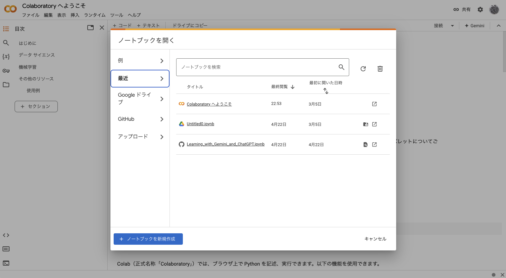
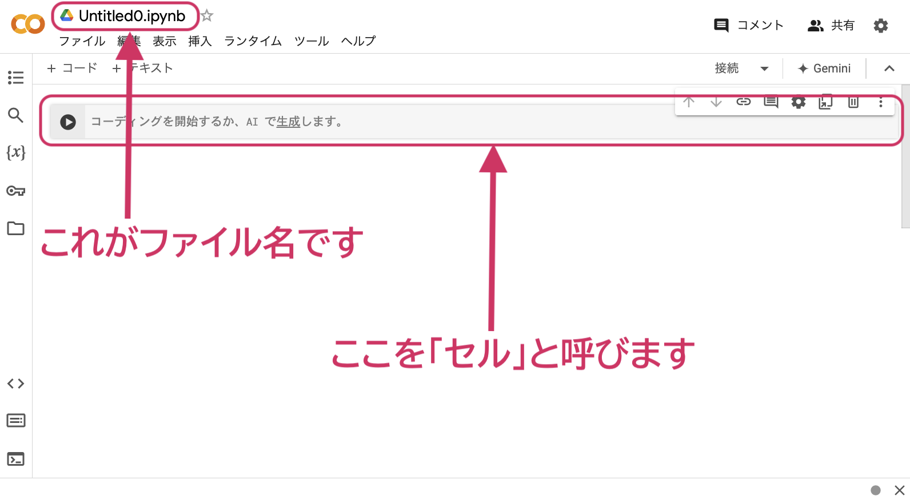
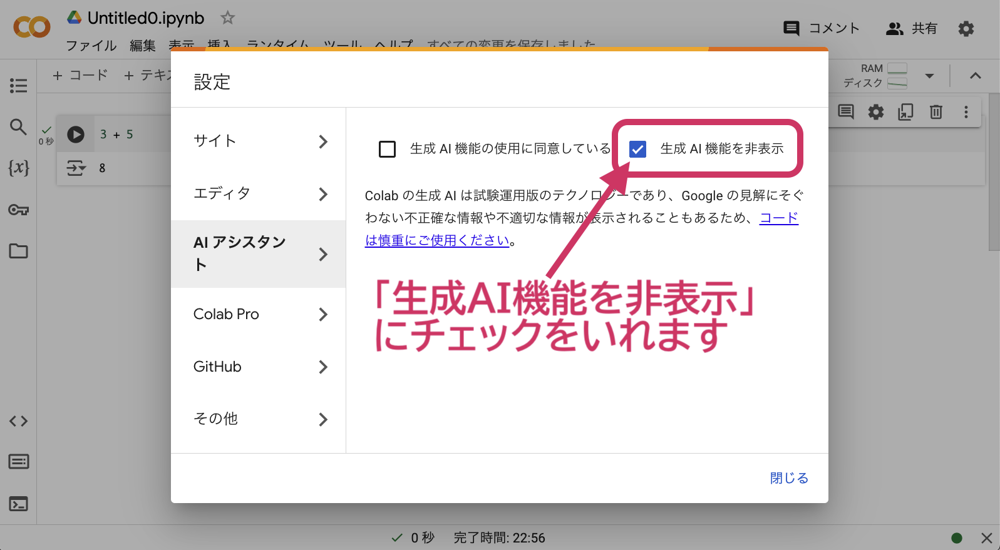
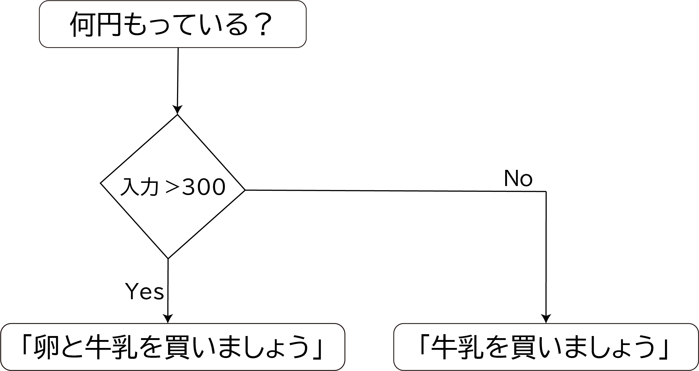

# コンピュータリテラシ発展 〜Pythonを学ぶ〜

## 第 2 回：Pythonを始めよう

情報学部 情報学科 情報メディア専攻
清水 哲也 ( shimizu@info.shonan-it.ac.jp )

---

# 今回の授業内容

---

# 今回の授業内容

- Pythonの特徴
- [Google Colaboratory](https://colab.research.google.com/?hl=ja) の使い方
- Pythonのきほん
- ある条件で処理を分ける
- オブジェクトの扱い
- 課題

---

# Pythonの特徴

---

# Pythonの特徴

Pythonは世界的に人気のあるプログラミング言語であり，その特徴は以下の通りです．

1. **シンプルで読みやすい構文**：Pythonはコードが読みやすく設計されています．
2. **汎用性**：Pythonはウェブ開発，データ分析，AI，機械学習，自動化など，幅広い用途で使用できます．
3. **豊富なライブラリ**：Pythonには標準ライブラリが含まれており，さらに多くのタスクを簡単に行うためのサードパーティライブラリがあります．
4. **インタプリタ型言語**：Pythonはインタプリタ型の言語でコードを一行ずつ実行します．これにより，開発中にコードの変更をすぐにテストできます．

---

# Google Colaboratory の使い方

---

# Google Colaboratory の使い方

- Pythonの開発環境として[Google Colaboratory](https://colab.research.google.com/?hl=ja)を使います
- Google Colabはクラウドに用意された[Jupyter Notebook](https://jupyter.org/)環境でブラウザさえあれば無料で利用可能です
- 大学のGoogleアカウント（@sit.shonan-it.ac.jp）でログインしておけば使用したファイルはGoogle Drive上に保存されます

---

# ノートブックの作成

<div Align=center>



</div>

---

# ノートブックの作成

<div Align=center>



</div>

---

# Colabをつかってみる

プログラムを書いて実行してみる

1. セルに「`3 + 5`」と入力します
2. セルの左側にある「三角ボタン」をクリックします（初回は少し時間がかかります）
3. 計算結果が表示されればOK

<div Align=center>


</div>

---

# Google Colabの使い方

基本的には以下の繰り返しです

- 「セル」にプログラムを入力する
- 「三角ボタン」を押す
- 結果を得る

---

# AIアシスタントの設定

Google ColabではAIアシスタント機能が利用できますが，この授業は学習のためAIアシスト機能を非表示にします．

<div Align=center>


</div>

---

# AIアシスタントの設定

「生成AI機能を非表示」にチェックを入れる

<div Align=center>



</div>

---

# Pythonのきほん

---

# データの性質

- 扱うデータの種類によってデータ型が異なります
- 例：「a」や「Hello」などは文字列
- 例：「1」や「-20」などは整数
- データの性質ごとに分類されています

### 整数を表示する場合

```python
print(1)
```

### 文字列を表示する場合

```python
print('hello world') or print("hello world")
```

---

# データの性質

<div Align=center>

| データ型 |    概要    |            例            |
| -------- | ---------- | ------------------------ |
| `str`    | 文字列     | `'abc'`, `"hello world"` |
| `int`    | 整数       | `1`, `-500`              |
| `float`  | 浮動小数点 | `1.23`                   |
| `bool`   | 真偽値     | `True` もしくは `False`  |
| `list`   | リスト     | `[1, 2, 3]`              |
| `tuple`  | タプル     | `(1,2,3)`, `1,2,3`       |
| `dict`   | 辞書       | `{'a':1, 'b':2}`         |

</div>

---

# オブジェクトと関数

### オブジェクト
- オブジェクトは「データ型」や「値」といった要素で構成されます
- 「データ型」はデータを性質に応じて分類したものです
- 「値」はデータそのもののことです
- 例：`'hello'`というオブジェクトは，データ型がstr型で，値がhelloとなります
- 参考：https://docs.python.org/ja/3/reference/datamodel.html

### 関数
- 入力値を与えると何らかの処理を実行し出力値を返すものです
- 例：`print()` 関数

---

# Pythonでの計算
参考：算術演算子（教科書:表2-2）（Colabの場合`print()`がなくてもOK）

### `+` ：加算（足し算）
足し算を行うときには演算子「`+`」を利用します．
```python
print(10 + 30)
```

### `-` ：減算（引き算）
引き算を行うときには演算子「`-`」を利用します．
```python
print(10 - 30)
```

---

# Pythonでの計算

### `*` ：乗算（掛け算）
掛け算を行うときには演算子「`*`」を利用します．「×」ではないので注意してください．
```python
print(10 * 30)
```

### `**` ：べき乗
べき乗（$n$乗，$a^n$）の計算を行うときには演算子「`**`」を利用します．
```python
print(10 ** 3)
```

---

# Pythonでの計算

### `/` ：除算（割り算）
割り算を行うときには演算子「`/`」を利用します．「÷」ではないので注意してください．
```python
print(10 / 3)
```

### `//` ：除算（小数点以下切り捨て）
小数点以下を切り捨てた割り算を行うときには演算子「`//`」を利用します．割り算の整数の商を求めます．
```python
print(10 // 3)
```

---

# Pythonでの計算

### `%` ：剰余（除算した余り）
割り算の余りを求める場合は演算子「`%`」を利用します．
```python
print(10 % 3)
```

### `divmod`関数 ：除算&剰余
Pythonには割り算を行ったときの小数点以下を切り捨てた答え（割り算の整数の商）とその余りを同時に求める関数が用意されています．
```python
print(divmod(10, 3))
```

---

# 数値演算子の優先順位

数値の演算には優先順位があります．

### 演算子による優先順位

演算子による優先順位の考え方は通常の数学と同じです．
```python
print(10 + 5 * 2)
```

### （）括弧による優先順位の変更
一般的な数学と同じで（）括弧でくくることで演算子の演算優先順位を任意に変更することができます．
```python
print((10 + 5) * 2)
```

---

# 異なるデータ型同士の計算

### 計算可能なのは整数型だけはなく文字列も計算可能です
文字列同士を結合したり，同じ文字列を繰り返し表示したりすることも可能です．

文字列を結合する場合
```python
print('Hello' + 'World!')
```
同じ文字列を繰り返す場合
```python
print('Hello' * 5)
```
何でもできるわけではないです．
```python
print('1' + 2)
```

---

# 異なるデータ型同士の計算

```python
print('1' + 2)
```
この場合はエラーとなります
```python
TypeError: can only concatenate str (not "int") to str
```
この翻訳は「("int"ではなく)strのみをstrに連結できます」となります．

<div Align=center>

| 関数名  |       意味       |
| ------- | ---------------- |
| `int()` | 型を整数型に変換 |
| `str()` | 型を文字列に変換 |

</div>

---

# オブジェクトを操作する

文字列オブジェクト内の文字をすべて大文字にする．
```python
print('hello world!'.upper())
``` 
文字列オブジェクトは「hello world!」でそのオブジェクトを操作する命令が「`upper()`」です．

「`upper()`」をメソッドといいます．メソッドは，データ型と密接に関係しています．なので，整数型のオブジェクトは`upper()`メソッドを実行できせん．

---

# 同じオブジェクトを使いまわす

- 同じオブジェクトを何度も使う場合はオブジェクトに名前をつけます
- オブジェクトの名前＝「**変数**」

```python
hi = 'hello'
print(hi)
```
一度実行しましょう
```python
hi = 'world'
print(hi)
```

---

# ある条件で処理を分ける

---

# 条件を判定する

条件分岐で条件を判定するためには，次のような **比較演算子** を使います

<div Align=center>

| 記号 |               意味               |
| ---- | -------------------------------- |
| `<`  | 左辺が右辺より小さい場合にTrue   |
| `<=` | 左辺が右辺以下の場合にTrue       |
| `>`  | 左辺が右辺より大きい場合にTrue   |
| `>=` | 左辺が右辺以上の場合にTrue       |
| `!=` | 左辺と右辺が一致しない場合にTrue |
| `==` | 左辺と右辺が一致する場合にTrue   |

</dic>

---

# 条件を判定する

- 比較演算子を使って判定してみる
```python
print(1 < 2)
```
```python
print(1 > 2)
```
- 比較演算子の結果は「**True**」か「**False**」が返ってきます
- 「**True**」か「**False**」を**真理値**と呼びます

---

# 条件に応じて処理をする

簡単な条件分岐による処理をしてみましょう

<div Align=center>



</div>

---

# 条件に応じて処理をする

条件分岐を行うために必要 `if` 文

```python
if 条件式:
    条件式がTrueのときの処理
else:
    条件式に当てはまらなかったときの処理
```
「もし〜ならば」という意味です
条件式には比較演算子などを使い判定をおこないます
「`else`」は「**それ以外**」という意味で条件式にあてはまらない場合の処理を書きます
Pythonでは「**インデント(空白)**」がとても大切です

---

# 条件に応じた処理をする

Colabの場合「インデント」は自動ではいります
（インデントは一般的に半角スペース4つ分ですが変更も可能です）
適切な「インデント」をつけないとエラーとなります

<div Align=center>


</div>

---

# 条件に応じた処理をする

それでは，実際にP.28の図のプログラムを組んでみましょう

```python
money = 400
if money > 300:
    print('卵と牛乳を買いましょう')
else:
    print('牛乳を買いましょう')
```
---

# 条件に応じた処理をする

<div Align=center>


</div>

---

# 条件に応じた処理をする

複数の条件式で判定を行う場合は「`elif`」（`else if`の略）を使って判定をおこないます．

```python
if 条件式1
    処理1
elif 条件式2
    処理2
elif 条件式3
    処理3
：
else:
    その他処理
```
P.32の図のプログラムをしてみてください

---

# オブジェクトの扱い

---

# 中身をあとから変更できるリスト型

- オブジェクトの集まりを扱うために「**データ構造**」という仕組みがあります
- その一つである「**リスト(list)型**」があります
- リスト型は「`[]`」で囲んで扱います

### リスト型の例
```python
[1]
[1,2,3]
['apple', 'orange', 'banana']
```

---

# 中身をあとから変更できるリスト型

- `[]`の中にオブジェクトを並べます
- オブジェクトが複数ある場合は「`,`(カンマ)」で区切ります
- リストの中身のオブジェクトを「**要素**」と呼びます
- 要素が何もなくてもOKです
- リストの中にリストを入れることもできます

### リスト型の例
```python
[1,2,3] # カンマで区切って複数のオブジェクトを扱う
['apple', 'orange', 'banana'] # 文字列も同じように扱える
[] # 要素が無い（空）のリストも作成できる
[[1, 2], [3, 4]] # リストの中にリストをいれることもできる
```

---

# リスト型のインデックス

- インデックスはリスト内の要素（オブジェクト）の位置を示します
- 「`リスト型[インデックス]`」という形で使います
- インデックスを使ってリスト内の要素を変更することもできます

### インデックスの例
```python
fruits = ['apple', 'orange', 'banana'] # リスト作成
print(fruits[0]) # 0番目の要素を表示
print(fruits[1]) # 1番目の要素を表示
fruits[1] = 'grape' # 1番目の要素を「grape」に変更
print(fruits) # リストの中身を確認
```

---

# リスト型にオブジェクトを追加

- リストにオブジェクトを追加することもできます
- `append()`メソッドを使ってリストに新たにオブジェクトを付けることができます

### append()の例
```python
number = [1, 2, 3] # リスト作成
number.append(4) # 「number」リストに要素「4」を追加
print(number) # リストの中身を確認
```

---

# リストからオブジェクトの取り出し

- リストからオブジェクトを取り出すときは「`pop()`」メソッドを使います
- 取り出したいオブジェクトのインデックスを指定して取り出します
- 取り出したあとはリストから取り出したオブジェクトはなくなります
- インデックスを指定しない場合は最後のオブジェクトが取り出されます

### pop()の例
```python
alphabet = ['A', 'B', 'C', 'D'] # リスト作成
char_C = alphabet.pop(2) # アルファベット「C」のインデックスを指定して取り出す
print(char_C) # 中身を確認
print(alphabet) # リストの中身を確認
char_last = alphabet.pop() # インデックスを指定しない場合最後のオブジェクトを取り出す
print(char_last) # 中身を確認
print(alphabet) # リストの中身を確認
```

---

# リストの中のデータを確認する

- 「`オブジェクト in リスト`」の形でリストの中の要素が存在することを判定できます
- 「`オブジェクト not in リスト`」の形でリストの中に要素が存在しないことを判定できます

### データ確認の例
```python
Kanto = ['Tokyo', 'Kanagawa', 'Chiba', 'Saitama', 'Ibaraki', 'Tochigi', 'Gunma'] # リスト作成
if 'Gunma' in Kanto: # GunmaがKantoリスト内に存在するか判定
    print('Gunmaは関東地方です') # 処理
else: # それ以外
    print('Gunmaは関東地方ではありません') # 処理

if 'Yamanashi' not in Kanto: # YamanashiがKantoリスト内に存在しないか判定
    print('Yamanashiは関東地方ではありません') # 処理
else: # それ以外
    print('Yamanashiは関東地方です') # 処理
```

---

# 中身をあとから変更できないタプル型

- リスト型と同じくオブジェクトを複数格納することができ中の値を読み込むことができる
- リスト型との違いは，一度タプル型をつくると格納されている要素やその順番を一切変更することができない
- 「`()`」で囲むことでタプルをつくることができます

### タプル型の例
```python
() # 空のタプル型の生成
(1,2) # 複数のオブジェクトで構成されたタプル
(1,) # オブジェクトが1つの場合でもカンマをつける
1,2 # ()がなくてもタプル型になる
1, # ()がない場合でオブジェクトが1つの場合もカンマをつけることでタプル型になる
```

---

# 中身をあとから変更できないタプル型

- リスト型と同じように複数のオブジェクトを「`,`」で区切ります
- 1つの要素のときでも「`,`」をつければタプルとなります
- 「`()`」がなくても「`,`」で区切ればタプルとなります

### タプル型の例
```python
sample_tuple = (10, 20) # タプルの生成
x, y = sample_tuple # タプルの中身を展開してx, yに代入
print(x)
print(y)

sample_tuple2 = 'A', 'B', 'C' # タプルの生成
a, b, c = sample_tuple2 # タプルの中身を展開してx, yに代入
print(a)
print(b)
print(c)
```

---

# キーと値をセットで扱う辞書型

- **辞書(dict)型**も同じくオブジェクトを複数格納するためのものです
- **キー** = 変更不可能なオブジェクト（文字列，数値，タプル）
- **値（バリュー）** = オブジェクト
- オブジェクトに対応するキーを指定してバリューを取り出します
- 「`{}`」で囲んで作成します
- キーとバリューの対応は「`キー:バリュー`」と表現します
- 複数のキーとバリューを格納する場合は「`,`」で区切ります

### dict型の例
```python
{} # 空のdict型
{'tea' : 100} # キーとバリューを格納
{'tea' : 100, 'coffee' : 200} # 複数のキーとバリューを格納
```

---

# 辞書型でキーを指定する

- dict（辞書）型のバリュー（値）を参照するには「`辞書名[キー]`」で指定します
- キーを指定するとそれに対応するバリューが出力されます
- 辞書に新しいキー，バリューを追加するには「`辞書名[追加キー]=追加バリュー`」と書きます

### dict型でキーの扱いの例
```python
my_dict = {'tea' : 100, 'coffee' : 200} # dict型の作成
print(my_dict['tea']) # キーを指定して対応するバリューを表示

my_dict['milk'] = 300 # 新たにキーとバリューを追加
print(my_dict) # dict型の中身を確認
```

---

# キーと値をセットで扱う辞書型

- 辞書の中のデータを確認したい場合
- 「`期待するキー名 in 辞書名`」で存在を確認できます
- リストの場合とほぼ同じです

### セットで扱う例
```python
my_dict = {'tea' : 100, 'coffee' : 200, 'milk' : 300} # dict型の作成
'tea' in my_dict # my_dict内に'tea'があるか確認
```

---

# 課題

---

# 課題2-1

- Moodleにある「SCfCL-2nd-prac.ipynb」ファイルをダウンロードしてColabにアップロードしてください
- 課題が完了したら「File」>「Download」>「Download .ipynb」で「.ipynb」形式でダウンロードしてください
- ダウンロードした.ipynbファイルをMoodleに提出してください
- 提出期限は **10月3日(木) 20時まで** です