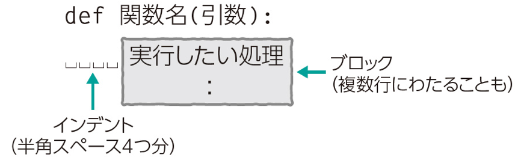

# コンピュータリテラシ発展 〜Pythonを学ぶ〜

## 第3回：Pythonを始めよう

情報学部 情報学科 情報メディア専攻
清水 哲也 ( shimizu@info.shonan-it.ac.jp )

---

# 今回の授業内容

---

# 今回の授業内容

- 前回の課題解説
- オブジェクトの扱い（前回の復習）
- 同じ処理を繰り返し行う
- 課題

---

# 前回の課題解説

---

# 前回の課題解説

- 前回の課題の解答例を示します
- 解答例について質問があればご連絡ください

## 解答例
（解答例作成後URL変更）
https://colab.research.google.com/drive/1AYgHFeBe9iASYEqlm9PalPsDDeK1zpzK?usp=sharing

---

# オブジェクトの扱い

---

# 中身をあとから変更できるリスト型

- オブジェクトの集まりを扱うために「**データ構造**」という仕組みがあります
- その一つである「**リスト(list)型**」があります
- リスト型は「`[]`」で囲んで扱います

### リスト型の例
```python
[1]
[1,2,3]
['apple', 'orange', 'banana']
```

---

# 中身をあとから変更できるリスト型

- `[]`の中にオブジェクトを並べます
- オブジェクトが複数ある場合は「`,`(カンマ)」で区切ります
- リストの中身のオブジェクトを「**要素**」と呼びます
- 要素が何もなくてもOKです
- リストの中にリストを入れることもできます

### リスト型の例
```python
[1,2,3] # カンマで区切って複数のオブジェクトを扱う
['apple', 'orange', 'banana'] # 文字列も同じように扱える
[] # 要素が無い（空）のリストも作成できる
[[1, 2], [3, 4]] # リストの中にリストをいれることもできる
```

---

# リスト型のインデックス

- インデックスはリスト内の要素（オブジェクト）の位置を示します
- 「`リスト型[インデックス]`」という形で使います
- インデックスを使ってリスト内の要素を変更することもできます

### インデックスの例
```python
number = [1, 2, 3, 4, 5] # リスト作成
```
インデックスの位置



---

# リスト型のインデックス

- 文字列のリストでも同じようにインデックスを使用できます

### インデックスの例(文字列)
```python
fruits = ['apple', 'orange', 'banana'] # リスト作成
print(fruits[0]) # 0番目の要素を表示
print(fruits[1]) # 1番目の要素を表示
fruits[1] = 'grape' # 1番目の要素を「grape」に変更
print(fruits) # リストの中身を確認
```

---

# リスト型にオブジェクトを追加

- リストにオブジェクトを追加することもできます
- `append()`：リストの最後に1つだけオブジェクトを追加します
- `extend()`：指定されたオブジェクトのすべての要素をリストの最後に追加します

### append()の例
```python
number = [1, 2, 3] # リスト作成
number.append(4) # 「number」リストに要素「4」を追加
print(number) # リストの中身を確認
```

### extend()の例
```python
number = [1, 2, 3] # リスト作成
number.extend([4,5]) # 「number」リストにオブジェクト「[4,5]」の要素を追加
print(number) # リストの中身を確認
```

---

# リストからオブジェクトの取り出し

- リストからオブジェクトを取り出すときは「`pop()`」メソッドを使います
- 取り出したいオブジェクトのインデックスを指定して取り出します
- 取り出したあとはリストから取り出したオブジェクトはなくなります
- インデックスを指定しない場合は最後のオブジェクトが取り出されます

### pop()の例
```python
alphabet = ['A', 'B', 'C', 'D'] # リスト作成
char_C = alphabet.pop(2) # アルファベット「C」のインデックスを指定して取り出す
print(char_C) # 中身を確認
print(alphabet) # リストの中身を確認
char_last = alphabet.pop() # インデックスを指定しない場合最後のオブジェクトを取り出す
print(char_last) # 中身を確認
print(alphabet) # リストの中身を確認
```

---

# リストの中のデータを確認する

- 「`オブジェクト in リスト`」の形でリストの中の要素が存在することを判定できます
- 「`オブジェクト not in リスト`」の形でリストの中に要素が存在しないことを判定できます

### データ確認の例
```python
Kanto = ['Tokyo', 'Kanagawa', 'Chiba', 'Saitama', 'Ibaraki', 'Tochigi', 'Gunma'] # リスト作成
if 'Gunma' in Kanto: # GunmaがKantoリスト内に存在するか判定
    print('Gunmaは関東地方です') # 処理
else: # それ以外
    print('Gunmaは関東地方ではありません') # 処理

if 'Yamanashi' not in Kanto: # YamanashiがKantoリスト内に存在しないか判定
    print('Yamanashiは関東地方ではありません') # 処理
else: # それ以外
    print('Yamanashiは関東地方です') # 処理
```

---

# 中身をあとから変更できないタプル型

- リスト型と同じくオブジェクトを複数格納することができ中の値を読み込むことができる
- リスト型との違いは，一度タプル型をつくると格納されている要素やその順番を一切変更することができない
- 「`()`」で囲むことでタプルをつくることができます

### タプル型の例
```python
() # 空のタプル型の生成
(1,2) # 複数のオブジェクトで構成されたタプル
(1,) # オブジェクトが1つの場合でもカンマをつける
1,2 # ()がなくてもタプル型になる
1, # ()がない場合でオブジェクトが1つの場合もカンマをつけることでタプル型になる
```

---

# 中身をあとから変更できないタプル型

- リスト型と同じように複数のオブジェクトを「`,`」で区切ります
- 1つの要素のときでも「`,`」をつければタプルとなります
- 「`()`」がなくても「`,`」で区切ればタプルとなります

### タプル型の例
```python
sample_tuple = (10, 20) # タプルの生成
x, y = sample_tuple # タプルの中身を展開してx, yに代入
print(x)
print(y)

sample_tuple2 = 'A', 'B', 'C' # タプルの生成
a, b, c = sample_tuple2 # タプルの中身を展開してx, yに代入
print(a)
print(b)
print(c)
```

---

# キーと値をセットで扱う辞書型

- **辞書(dict)型**も同じくオブジェクトを複数格納するためのものです
- **キー** = 変更不可能なオブジェクト（文字列，数値，タプル）
- **値（バリュー）** = オブジェクト
- オブジェクトに対応するキーを指定してバリューを取り出します
- 「`{}`」で囲んで作成します
- キーとバリューの対応は「`キー:バリュー`」と表現します
- 複数のキーとバリューを格納する場合は「`,`」で区切ります

### dict型の例
```python
{} # 空のdict型
{'tea' : 100} # キーとバリューを格納
{'tea' : 100, 'coffee' : 200} # 複数のキーとバリューを格納
```

---

# 辞書型でキーを指定する

- dict（辞書）型のバリュー（値）を参照するには「`辞書名[キー]`」で指定します
- キーを指定するとそれに対応するバリューが出力されます
- 辞書に新しいキー，バリューを追加するには「`辞書名[追加キー]=追加バリュー`」と書きます

### dict型でキーの扱いの例
```python
my_dict = {'tea' : 100, 'coffee' : 200} # dict型の作成
print(my_dict['tea']) # キーを指定して対応するバリューを表示

my_dict['milk'] = 300 # 新たにキーとバリューを追加
print(my_dict) # dict型の中身を確認
```

---

# キーと値をセットで扱う辞書型

- 辞書の中のデータを確認したい場合
- 「`期待するキー名 in 辞書名`」で存在を確認できます
- リストの場合とほぼ同じです

### セットで扱う例
```python
my_dict = {'tea' : 100, 'coffee' : 200, 'milk' : 300} # dict型の作成
'tea' in my_dict # my_dict内に'tea'があるか確認
```

---

# 同じ処理を繰り返し行う

---

# 要素の数だけ処理を繰り返す

- あるデータ構造に格納されている要素（オブジェクト）の数だけ，繰り返し処理をする = **forループ**
- 繰り返し（イテレート）可能なオブジェクトを **イテラブル** と呼ぶ

```python
for 変数 in イテラブル:
    ブロック
```

**注意点**
- イテラブルの後には必ず「:（コロン）」をつけてください
- ブロック（処理）の前にはインデントを入れてください

---

# 要素の数だけ処理を繰り返す（リストのforループ）

- リストを用いたforループ
- リストオブジェクトに格納されている要素の数だけ繰り返します

```python
number = [1, 2, 3, 4, 5]
for i in number:
    print('test')
```

- 要素の数だけ繰り返すのでリストの要素を扱うこともできます

```python
number = [1, 2, 3, 4, 5]
for i in number:
  print(i)
```

- リストは数値だけでなく文字列でも要素数分を繰り返すことができます

```python
fruits = ['apple', 'orange', 'banana']
for fruit in fruits:
  print(fruit)
```

---

# 要素の数だけ処理を繰り返す（range()関数）

- 「 **range(開始する値, 終了する値)** 」と指定すると，開始する値から終了する値を超えない範囲で1ずつカウントアップされます
  - 例： ``range(0, 3)`` を実行してみましょう
- ここで「開始する値」が「0」の場合は省略することができます
  - 例： ``range(0, 3)`` = ``range(3)`` 同じ結果になることを確認してみましょう

```python
print(list(range(0, 3)))
print(list(range(3)))
```

- ``range()`` 関数とforループを使ってみましょう

```python
for count in range(3):
    print(count)
```

---

# 要素の数だけ処理を繰り返す（インデックスと要素）

- リスト型では **インデックス** で値を参照できます
- インデックスをforループで同時に取り出すことができます
- `enumerate()`関数を使うことでインデックスと要素を同時に取り出すことできます

```python
fruits = ['apple', 'orange', 'banana', 'grape']
for i, fruit in enumerate(fruits):
  print(i, fruit)
```

---

# 要素の数だけ処理を繰り返す（辞書のforループ）

- 辞書のforループの使い方には3つの方法があります
  - **キーだけ** を取り出す方法： `keys()`
  - **バリューだけ** を取り出す方法： `values()`
  - **キー** と **バリュー** を取り出す方法： `items()`

```python
fruits = {'apple':100, 'orange':200}
print(fruits.keys())
print(fruits.values())
print(fruits.items())
```

---

# 要素の数だけ処理を繰り返す（辞書のforループ）

- キーを取り出す方法
```python
fruits = {‘apple’:100,‘orange’:200,’banana’:300}
for fruit in fruits.keys():
  print(fruit)
```
- バリューを取り出す方法
```python
fruits = {‘apple’:100,‘orange’:200,’banana’:300}
for money in fruits.values():
  print(money)
```
- キーとバリューを取り出す方法
```python
fruits = {‘apple’:100,‘orange’:200,’banana’:300}
for fruit, money in fruits.items():
  print(fruit, money)
```

---

# 処理を繰り返す（条件が続く限り）

- 条件が成立している限り処理を繰り返すことを考えます
- ``while`` ループを使います

```python
while 条件式:
  ブロック
```
whileの例
```python
i = 0
while i < 10:
  print('hello')
  i += 1 # i += 1 は i = i + 1 と同じ意味です
```
最後の行の ``i += 1`` がないと無限ループになってしまうので注意をしてください

---

# 処理を繰り返す（処理の途中で抜け出す）

- 処理の途中でループを抜け出すことができます
- ``break`` 文をつかうと途中でループを抜け出すことができます
- ``if`` 文などと組み合わせて使用します

```python
fruits = ['apple', 'orange', 'banana', 'grape']
for i, fruit in enumerate(fruits):
  print(i, fruit)
  if i == 2:
    break
```


---

# 課題

---

# 課題3

- Moodleにある「SCfCL-3rd-prac.ipynb」ファイルをダウンロードしてColabにアップロードしてください
- 課題が完了したら「File」>「Download」>「Download .ipynb」で「.ipynb」形式でダウンロードしてください
- ダウンロードした **.ipynbファイル** をMoodleに提出してください
- 提出期限は **5月2日(木) 20時まで** です
