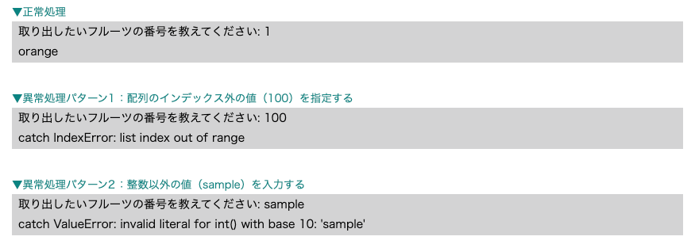

# コンピュータリテラシ発展 〜Pythonを学ぶ〜

## 第3回：Pythonを始めよう

情報学部 情報学科 情報メディア専攻
清水 哲也 ( shimizu@info.shonan-it.ac.jp )

---

<div Align=center>

# 今回の授業内容

</div>

---

# 今回の授業内容

- 前回の課題解説
- 同じ処理を繰り返し行う
- 定義した処理を実行する
- ファイルを機能ごとに分けて再利用する
- 例外処理
- 課題

---

<div Align=center>

# 前回の課題解説

</dvi>

---

# 前回の課題解説

- 前回の課題の解答例を示します
- 解答例について質問があればご連絡ください

## 解答例
https://colab.research.google.com/drive/12pH6IOwfLNZQzzwdzYEtcIH9nOqW0NSJ?usp=sharing

---

<div Align=center>

# 同じ処理を繰り返し行う

</div>

---

# 要素の数だけ処理を繰り返す

- あるデータ構造に格納されている要素（オブジェクト）の数だけ，繰り返し処理をする = **forループ**
- 繰り返し（イテレート）可能なオブジェクトを **イテラブル** と呼ぶ

```python
for 変数 in イテラブル:
    ブロック
```

**注意点**
- イテラブルの後には必ず「:（コロン）」をつけてください
- ブロック（処理）の前にはインデントを入れてください

---

# 要素の数だけ処理を繰り返す（リストのforループ）

- リストを用いたforループ
- リストオブジェクトに格納されている要素の数だけ繰り返します

```python
number = [1, 2, 3, 4, 5]
for i in number:
  print('test')
```

- 要素の数だけ繰り返すのでリストの要素を扱うこともできます

```python
number = [1, 2, 3, 4, 5]
for i in number:
  print(i)
```

- リストは数値だけでなく文字列でも要素数分を繰り返すことができます

```python
fruits = ['apple', 'orange', 'banana']
for fruit in fruits:
  print(fruit)
```

---

# 要素の数だけ処理を繰り返す（range()関数）

- 「 **range(開始する値, 終了する値)** 」と指定すると，開始する値から終了する値を超えない範囲で1ずつカウントアップされます
  - 例： ``range(0, 3)`` を実行してみましょう
- ここで「開始する値」が「0」の場合は省略することができます
  - 例： ``range(0, 3)`` = ``range(3)`` 同じ結果になることを確認してみましょう

```python
print(list(range(0, 3)))
print(list(range(3)))
```

- ``range()`` 関数とforループを使ってみましょう

```python
for count in range(3):
    print(count)
```

---

# 要素の数だけ処理を繰り返す（インデックスと要素）

- リスト型では **インデックス** で値を参照できます
- インデックスをforループで同時に取り出すことができます
- `enumerate()`関数を使うことでインデックスと要素を同時に取り出すことできます

```python
fruits = ['apple', 'orange', 'banana', 'grape']
for i, fruit in enumerate(fruits):
  print(i, fruit)
```

---

# 要素の数だけ処理を繰り返す（辞書のforループ）

- 辞書のforループの使い方には3つの方法があります
  - **キーだけ** を取り出す方法： `keys()`
  - **バリューだけ** を取り出す方法： `values()`
  - **キー** と **バリュー** を取り出す方法： `items()`

```python
fruits = {'apple':100, 'orange':200}
print(fruits.keys())
print(fruits.values())
print(fruits.items())
```

---

# 要素の数だけ処理を繰り返す（辞書のforループ）

- キーを取り出す方法
```python
fruits = {‘apple’:100,‘orange’:200,’banana’:300}
for fruit in fruits.keys():
  print(fruit)
```
- バリューを取り出す方法
```python
fruits = {‘apple’:100,‘orange’:200,’banana’:300}
for money in fruits.values():
  print(money)
```
- キーとバリューを取り出す方法
```python
fruits = {‘apple’:100,‘orange’:200,’banana’:300}
for fruit, money in fruits.items():
  print(fruit, money)
```

---

# 処理を繰り返す（条件が続く限り）

- 条件が成立している限り処理を繰り返すことを考えます
- ``while`` ループを使います

```python
while 条件式:
  ブロック
```
whileの例
```python
i = 0
while i < 10:
  print('hello')
  i += 1 # i += 1 は i = i + 1 と同じ意味です
```
最後の行の ``i += 1`` がないと無限ループになってしまうので注意をしてください

---

# 処理を繰り返す（処理の途中で抜け出す）

- 処理の途中でループを抜け出すことができます
- ``break`` 文をつかうと途中でループを抜け出すことができます
- ``if`` 文などと組み合わせて使用します

```python
fruits = ['apple', 'orange', 'banana', 'grape']
for i, fruit in enumerate(fruits):
  print(i, fruit)
  if i == 2:
    break
```

---

<div Align=center>

# 定義した処理を実行する

</dvi>

---

# 定義した処理を実行する

- Pythonの関数は「**`def`**」を使って定義することができる
- `def` は，definition(「定義」という意味の英単語)の省略形です
- `if` 文や `while` 文と同じようにインデントが必要です
- 処理が複数行にわたる場合は2行目以降もインデントが必要になります

<div Align=center>


</div>

---

# 関数にわたす情報・関数から戻ってくる情報

- **引数** ：関数`f()` の `()` 内にあるオブジェクトを引数と呼びます
- 引数はその関数への入力値（関数にわたす情報）です
- 「`,`」で区切ることで複数の引数を関数にわたすことができます
- 引数をわたす方法は「**位置引数**」と「**キーワード引数**」の2種類があります
- **位置引数**：引数の順番によって引数を関数にわたす
- **キーワード引数**：引数名を指定した形式でわたす

---

# 関数にわたす情報・関数から戻ってくる情報

```python
def f(x, y):
  return 2 * x + y

# 位置引数の場合
i = f(10, 20)       # f(20, 10)は結果が異なる
print(i)

# キーワード引数
j = f(x=10, y=20)   # f(y=20, x=10)でも同じ結果になる
print(j)
```

---

# 関数にわたす情報・関数から戻ってくる情報（オプション引数）

- 引数をあらかじめ指定することで関数を呼び出す時に引数を省略することができます
- こうした引数を **オプション引数** と呼びます
- オプション引数を指定していても関数を呼び出す時に引数を指定することで通常の引数と同じ処理ができます

```python
def double(x = 2):
  return x * 2

# 関数に引数をわたさないとオプション引数が使用される
i = double()
print(i)

# 関数に引数をわたすとその値が使用される
j = double(3)
print(j)
```

---

# 関数にわたす情報・関数から戻って来る情報（戻り値）

- **戻り値** ：関数が何を出力するかを定義するものです
- `return` の後に書きます
- `return` を定義しない関数は，戻り値がないということになり「**None**」を返します
- Noneは，値が存在しないことを意味します

---

# 変数が使える範囲

- **変数** を関数のブロック内で定義するか，関数のブロック外で定義するかによって，**変数が使える範囲（スコープ）が異なります**
- **グローバル変数** ：関数のブロック外で定義される変数，プログラム内のどこからでも呼び出すことができます
- **ローカル変数** ：関数のブロック内で定義される変数，その関数内でのみ呼び出すことができます

---

# 変数が使える範囲（グローバル変数）

```python
global_number = 10  # グローバル変数の定義

def show():
  print('グローバル変数の値：', global_number)

# グローバル変数の表示
show()

# グローバル変数の値を変更
global_number = 5
# グローバル変数の表示
show()
```

---

# 変数が使える範囲（ローカル変数）


```python
def show():
  local_number = 5
  print('ローカル変数の値：', local_number)

# ローカル変数の表示
show()

# local_numberを自体を呼び出して表示
print(local_number)

```
この場合エラーが表示されると思います
```python
NameError: name 'local_number' is not defined
```
ローカル変数を範囲外で参照したのでエラー（定義されていない）が発生します

---

# あらかじめ用意されている関数

- `print()` や `str()` などの関数はあらかじめ用意されている関数です
- これらを **組み込み関数** と呼びます

<dvi Align=cetenr>

|  関数名   |                                  概要                                  |
| --------- | ---------------------------------------------------------------------- |
| `print()` | 引数の値を画面に出力する                                               |
| `input()` | プロンプトを表示してユーザからの入力を受け付け，結果を文字列として返す |
| `len()`   | 渡したオブジェクトの持つ要素の個数を返す                               |
| `type()`  | 引数のデータ型を返す                                                   |

</div>


組み込み関数：https://docs.python.org/ja/3/library/functions.html#builtinfunctions


---

<dvi Align=center>

# ファイルを機能ごとに分けて再利用

</div>

---

# ファイルを機能ごとに分けて再利用する

- Pythonではプログラムを便利に書くために **モジュール** と呼ばれる仕組みがあります
- モジュールは複数の関数を再利用できるようにしたものです
- 多くの先人が作った便利な関数を利用することができます
- 使いたいモジュールをPythonに教えてあげることを **インポート** と呼びます
- インポートすると，モジュール内の変数や関数を利用することができます
- インポート：「**import モジュール名**」
- モジュール内の関数：「**モジュール名.関数名**」
- インポート対象を指定：「**from モジュール名 import 関数名**」
- モジュール名を変更してインポート：「**import モジュール名 as 別名**」


---

# 使いたいファイルを読み込ませる

- 自分や他人が作った有用なプログラムを再利用します
- ここでは簡単な例を示します
- 自作モジュール（hello.py）
```python
def many_times(count):
  s = count * 'hello '
  print(s)
```
- Moodleから「hello.py」ファイルをダウンロードしてください
- ColabでGoogle Driveをマウントしてください
- 今開いているノートと同じ場所（フォルダ）に「hello.py」をアップロードしてください

---

# 使いたいファイルを読み込ませる

- 自作モジュールを使用する側

```python
import sys
ROOTPATH = '/content/drive/MyDrive/(開いているノートがあるフォルダ)'
sys.path.append(ROOTPATH)
import hello

hello.many_times(3)
```

- 先ほどアップロードした「hello.py」を読み込むためにファイルがある場所（パス）を指定します
- 「hello.py」で定義されている関数 `many_times` を利用することができます

---

# 使いたいファイルを読み込ませる

- 自作モジュールを使用する側
- インポート対象を指定することもできます
- 今回は `many_times()` 関数のみをインポートします

```python
import sys
ROOTPATH = '/content/drive/MyDrive/(開いているノートがあるフォルダ)'
sys.path.append(ROOTPATH)
from hello import many_times

many_times(3)
```

---

# 使いたいファイルを読み込ませる

- 自作モジュールを使用する側
- 名前を変更してインポートします
- helloモジュールをhiとしてインポートします

```python
import sys
ROOTPATH = '/content/drive/MyDrive/(開いているノートがあるフォルダ)'
sys.path.append(ROOTPATH)
import hello as hi

hi.many_times(3)
```

---

# あらかじめ用意されているライブラリを使う

- 標準ライブラリ：Pythonのインストール時に同梱されているライブラリ
- https://docs.python.org/ja/3/library/index.html
- Colabでは標準ライブラリ以外にもたくさんのライブラリが用意されています
- `!pip list` で確認できます
- 例：標準ライブラリ内の日付や時刻を扱うdatetimeモジュールを使って，実行日の日付を出力するプログラム

```python
import datetime

date = datetime.date.today()
print(date)
```

---

<div Align=center>

# 例外処理

</div>

---

# 例外処理

- 例外とは実行中に検出されたエラーを指します
- Webスクレイピングなどのプログラムは将来変更される可能性が高いため、壊れずに動くことは保証されません
- プログラムがエラーに遭遇した場合，事前に指示を与えることが重要です
- 例外処理を導入することでプログラムがエラーに対処する方法を指定できます

---

# `try, except` 文

- 例外処理の基本は `try` と `except` 文で構成されます
- `try` ブロックには例外が発生する可能性のあるコードを記述
- 例外が発生しない場合：`try` ブロックの処理が正常に実行
- 例外が発生する場合：`except` ブロックに指定した例外の種類に応じた処理が実行
- 例外処理を使わない場合，例外が発生するとプログラムは中断される可能性があります

----

# `try, except` 文

例外処理がない場合のプログラム
```python
fruits = ['apple', 'orange', 'banana']
input_value = input('取り出したいフルーツの番号を教えてください：')

print(fruits[int(input_value)])
```

- このプログラムでは「-3〜2」の値のみ正常になります
- それ以外の数値や文字を入力するとエラーになります

----

# `try, except` 文

例外処理を行うプログラム
```python
fruits = ['apple', 'orange', 'banana']
input_value = input('取り出したいフルーツの番号を教えてください：')

try:
  print(fruits[int(input_value)])
except IndexError as e:
  print('catch IndexError:', e)
except ValueError as e:
  print('catch ValueError:', e)
```

---

# `try, except` 文

<div Align=center>



</div>

- 「except 例外型 as 変数名:」変数に例外オブジェクトを格納することができます
- 「except 例外型:」でも可能です


---

# 課題

---

# 課題

- Moodleにある「SCfCL-3th-prac.ipynb」ファイルをダウンロードしてColabにアップロードしてください
- 課題が完了したら「File」>「Download」>「Download .ipynb」で「.ipynb」形式でダウンロードしてください
- ダウンロードした **.ipynbファイル** をMoodleに提出してください
- 提出期限は **10月10日(木) 20時まで** です
