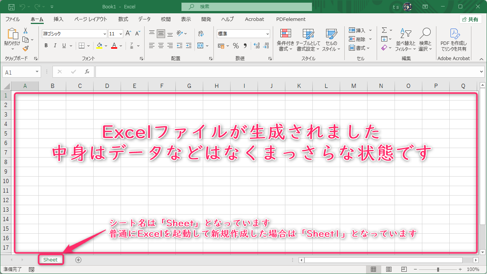
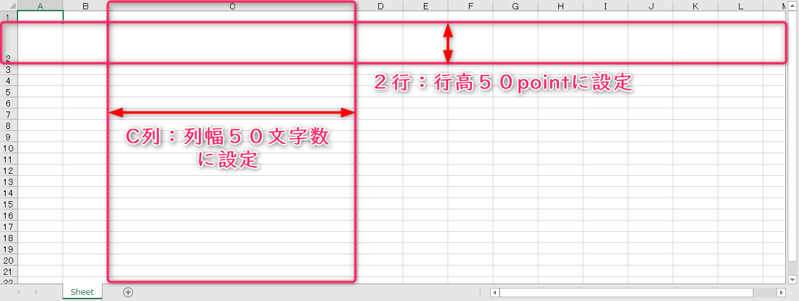
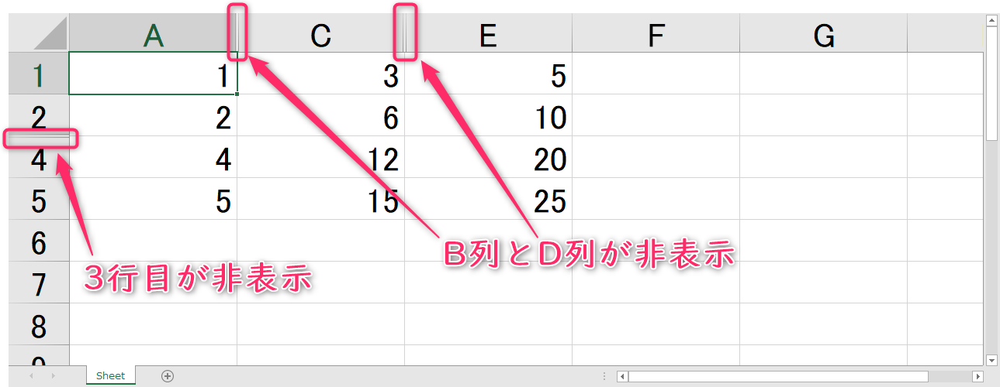
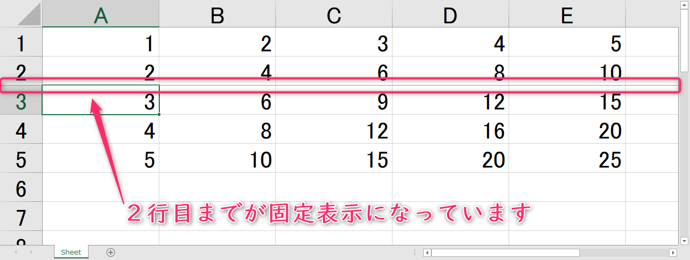

# コンピュータリテラシ発展 〜Pythonを学ぶ〜

## 第5回：Excel作業を自動化しよう(2)

情報学部 情報学科 情報メディア専攻
清水 哲也 ( shimizu@info.shonan-it.ac.jp )

---

<div Align=center>

# 今回の授業内容

</div>

---

# 今回の授業内容

- [前回の課題解説](#前回の課題解説)
- [Excelファイルの編集](#excelファイルを編集する)
- [Excelのレイアウトを編集](#excelのレイアウトを編集)
- [課題](#課題)

---

<div Align=center>

# 前回の課題解説

</div>

---

# 前回の課題解説

- 前回の課題の解答例を示します
- 解答例について質問があればご連絡ください

## 解答例

https://colab.research.google.com/drive/1PDZT6k7I5pMeuG0a1um54I9rC801YLvS?usp=sharing

---

<div Align=center>

# Excelファイルを編集する

</div>

---

# Excelファイルを新規作成する

- Excelファイル（ワークブック）を新規作成します

```python
import openpyxl as op

wb = op.Workbook()
wb.save('filename.xlsx')
```

- `Workbook`の引数を空にすると新しいワークブックを読み込みます
- `save()`メソッドで保存します
- 保存場所を指定したい場合はパスを含めて指定する必要があります

---

# Excelファイルを新規作成する

- Excelファイル（ワークブック）を新規作成します（パスを含む場合）

```python
import openpyxl as op

wb = op.Workbook()
wb.save('/content/drive/MyDrive/???/filename.xlsx')
```

- `Workbook`の引数を空にすると新しいワークブックを読み込みます
- `save()`メソッドで保存します
- 保存場所を指定したい場合はパスを含めて指定する必要があります

---

# 新規作成したExcelファイルの確認

<div Align=center>



</div>

---

# Excelシートを追加/削除します

- 新しいシートを追加します

```py
Workbookオブジェクト.create_sheet()
```

- 挿入位置とシート名を指定してシートを追加します

```py
Workbookオブジェクト.create_sheet(index = 数字, title = 'シート名')
```

- Excelシートを削除します

```py
Workbookオブジェクト.remove(Worksheetオブジェクト)
```

---

# Excelシートを追加/削除します

- 新しいシートを追加します

```py
wb = op.Workbook()

wb.create_sheet()
print(wb.sheetnames)
wb.save('/content/drive/MyDrive/???/create_sheet.xlsx')
```

<div Align=center>


</div>

---

# Excelシートを追加/削除します

- 挿入位置とシート名を指定して新しいシートを追加します

```py
wb = op.Workbook()

wb.create_sheet(index = 0, title = 'NewSheet')
print(wb.sheetnames)
wb.save('/content/drive/MyDrive/???/create_sheet.xlsx')
```

<div Align=center>


</div>

---

# Excelシートを追加/削除します

- シートを追加して既存のシートを削除します

```py
wb = op.Workbook()

wb.create_sheet()
print(wb.sheetnames)

wb.remove(wb[‘Sheet’])
print(wb.sheetnames)
```
---

# セルの値を編集します

- 指定したセルを編集します
  - 文字列を入力します　：　`Worksheetオブジェクト[セル] = '文字列'`
  - 数値を入力します　：　`Worksheetオブジェクト[セル] = 数値`
  - 数式を入力します　：　`Worksheetオブジェクト[セル] = '=数式'`

---

# セルの値を編集する

```py
wb = op.Workbook()
sheet = wb.active

sheet['B2'] = '文字列'       # 文字列
sheet['B3'] = '10'          # 文字列としての数字
sheet['B4'] = 10            # 数字
sheet['B5'] = 20            # 数字
sheet['B6'] = '=sum(B4:B5)' # Excelの関数

wb.save('/content/drive/MyDrive/???/cell.xlsx')
```

---

# セルの値を編集します（結果）

<div Align=center>


</div>

---

# フォントを設定します

- `Font()`関数：セルのフォント設定をする関数です
- `Font()`関数を使用するには`op.styles.fonts.Font`と書く必要があります
- 書くのが大変なので関数を指定してインポートしておきます

```py
import openpyxl as op
from openpyxl.styles.fonts import Font
```

- `Font`関数の基本的な使い方です

```py
Font(キーワード引数1=値, キーワード引数2=値・・・)
```

詳細：https://openpyxl.readthedocs.io/en/stable/styles.html

---

# フォントを設定します

- `Font`関数の基本的な使い方です

```py
Font(キーワード引数1=値, キーワード引数2=値・・・)
```

- 例：フォントサイズを18pt, 太文字にする設定です

```py
Font(size=18, bold=True)
```

- 例：フォントサイズを24pt, 斜体にする設定です

```py
Font(size=24, italic=True)
```

---

# `Font()`関数の代表的な引数

<div Align=center>

|  引数名  | データ型 |                            解説                            |
| -------- | -------- | ---------------------------------------------------------- |
| `name`   | 文字列型 | フォント名を指定します（例：`name='メイリオ'`）            |
| `size`   | 整数型   | フォントsizeを変更します（例：`size=18`）                  |
| `bold`   | ブール型 | `True`で太文字になります（例：`bold=True`）                |
| `italic` | ブール型 | `True`でイタリック(斜体)になります（例：`italic=True`）    |
| `color`  | 文字列型 | カラーコードで文字の色を指定します（例：`color='FF0000'`） |
| `strike` | ブール型 | `True`で打ち消し線が引けます（例：`strike=True`）          |

</div>

---

# フォントを設定します

```py
wb = op.Workbook()
sheet = wb.active

sheet['B2'] = '18pt bold'
sheet['B2'].font = Font(size=18, bold=True)

sheet['B4'] = '24pt 下線'
sheet['B4'].font = Font(size=24, underline='single')

wb.save('/content/drive/MyDrive/???/font.xlsx')
```

---

# フォントを設定します（結果）

<div Align=center>


</div>

---

<div Align=center>

# Excelのレイアウトを編集

</div>

---

# Excelの行高と列幅を設定する

- Excelの行高と列幅を設定する方法
  - **行高**：行番号を指定して高さの数値（**ポイント**）を入力します
  ```py
  Worksheetオブジェクト.row_dimensions[行番号].height = 高さの数値
  ```
  - **列幅**：列番号を指定して幅の数値（**文字数**）を入力します
  ```py
  Worksheetオブジェクト.column_dimensions[列番号].width = 幅の数値
  ```
行高と列幅で単位が異なるので注意が必要です

---

# Excelの行高と列幅を設定する

- Excelの行高と列幅を設定する例です
  - **行高の設定**：2行目を「50」に設定します
  - **列幅の設定**：C列目を「50」に設定します

```py
wb = op.Workbook()
sheet = wb.active

sheet.row_dimensions[2].height = 50
sheet.column_dimensions['C'].width = 50
wb.save('/content/drive/MyDrive/???/row_column.xlsx')
```

---

# Excelの行高と列幅を設定する（結果）

<div Align=center>



</dvi>

---

# Excelの行や列を非表示にする

## 行や列を非表示にする`hidden`属性

### 行や列を指定して非表示設定にします
```py
Worksheetオブジェクト.row_dimensions[行番号].hidden = True
Worksheetオブジェクト.column_dimensions[列番号].hidden = True
```
### 非表示の行や列を表示します
```py
Worksheetオブジェクト.row_dimensions[行番号].hidden = False
Worksheetオブジェクト.column_dimensions[列番号].hidden = False
```

---


# Excelの行や列を非表示にする

- 3行目とB,D列を非表示設定にする例です

```py
wb = op.Workbook()
sheet = wb.active

#セルA1〜E5に1〜25の数字を入れる
for i in range(1,6):
  for j in range(1,6):
    sheet.cell(j,i).value = i * j

sheet.row_dimensions[3].hidden = True			# 3行目を非表示
sheet.column_dimensions['B'].hidden =True		# B行を非表示
sheet.column_dimensions['D'].hidden =True		# D行を非表示
wb.save('/content/drive/MyDrive/???/row_column_hidden.xlsx')
```

---

# Excelの行や列を非表示にする

- 3行目とB,D列を非表示設定にする例です

<div Align=center>



</div>

---

# Excelの行と列を固定表示にする

## Excelの行と列を固定表示します
- 固定する行や列の下もしくは右，右下のセルを指定します
- 例：1行目のみ固定する場合：指定するセルは「`A2`」
- 例：B列まで固定する場合：指定するセルは「`C1`」
- 例：2行目とC列まで固定する場合：指定するセルは「`D3`」

```py
Worksheetオブジェクト.freeze_panes = セル
```

---

# Excelの行と列を固定表示にする

- ２行目までを固定にします

```py
wb = op.Workbook()
sheet = wb.active

#セルA1〜E5に1〜25の数字を入れる
for i in range(1,6):
  for j in range(1,6):
    sheet.cell(j,i).value = i * j

sheet.freeze_panes = 'A3'	# 2行目までを固定:セルA3を指定

wb.save('/content/drive/MyDrive/???/freeze-panes.xlsx')
```

---

# Excelの行と列を固定表示にする(結果)

<div Align=center>



</div>

---

<div Align=center>

# 課題

</div>

---

# 課題

- Moodleにある「SCfCL-05-prac.ipynb」ファイルをダウンロードしてColabにアップロードしてください
- 課題が完了したら「File」>「Download」>「Download .ipynb」で「.ipynb」形式でダウンロードしてください
- ダウンロードした **.ipynbファイル** と作成した **Excelファイル3つ** をMoodleに提出してください
- 提出期限は **10月24日(木) 20時まで** です
