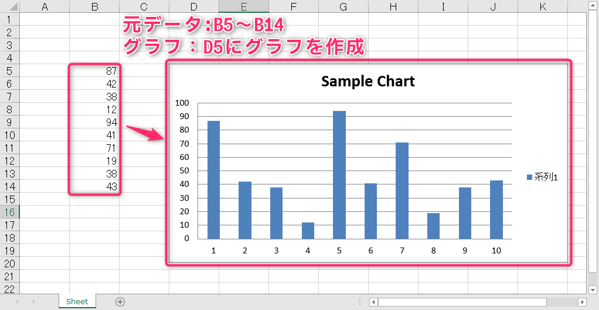

# コンピュータリテラシ発展 〜Pythonを学ぶ〜

## 第6回：Excel作業を自動化しよう(3)

情報学部 情報学科 情報メディア専攻
清水 哲也 ( shimizu@info.shonan-it.ac.jp )

---

<div Align=center>

# 今回の授業内容

</div>

---

# 今回の授業内容

- [前回の課題解説](#前回の課題解説)
- [Excelのグラフを作成する](#excelのグラフを作成する)
- [課題](#課題)

---

<div Align=center>

# 前回の課題解説

</div>

---

# 前回の課題解説

- 前回の課題の解答例を示します
- 解答例について質問があればご連絡ください

## 解答例

https://colab.research.google.com/drive/1FUy1VZf7t6wZU6pN0PVXixRZeUaBJBXs?usp=sharing

---

<div Align=center>

# Excelのグラフを作成する

</div>

---

# Excelのグラフを作成する

## ここで学ぶことを以下にまとめます
- [グラフが読み込むデータを決める](#グラフが読み込むデータを決める)
- [グラフの種類を決める](#グラフの種類を決める)
- [グラフにデータをわたす](#グラフにデータをわたす)
- [グラフをつくる](#グラフをつくる)
- [データから系列をつくる](#データから系列をつくる)

---

# グラフが読み込むデータを決める

- グラフを作成するために元となるデータが必要です
- 元データのセルを範囲選択するための関数
  - `Reference()`関数

```py
Reference(Worksheetオブジェクト,
          min_col = データ取得を始めるcolumn位置,
          min_row = データ取得を始めるrow位置,
          max_col = データ取得を終えるcolumn位置,
          max_row = データ取得を終えるrow位置)
```

---

# データ読み込み例

 
```py
Reference(Worksheetオブジェクト,
          min_col = 3, # 元データの開始列（左上）番号
          min_row = 3, # 元データの開始行（左上）番号
          max_col = 4, # 元データの終了列（右下）番号
          max_row = 12 # 元データの終了行（右下）番号
          )
```


---

# グラフの種類を決める

## 代表的なグラフの種類
- [BarChart（棒グラフ）](https://openpyxl.readthedocs.io/en/latest/charts/bar.html)
- [PieChart（円グラフ）](https://openpyxl.readthedocs.io/en/latest/charts/pie.html)
- [LineChart（折れ線グラフ）](https://openpyxl.readthedocs.io/en/latest/charts/line.html)
- [ScatterChart（散布図）](https://openpyxl.readthedocs.io/en/latest/charts/scatter.html)
- [それ以外](https://openpyxl.readthedocs.io/en/latest/charts/introduction.html)

---

# グラフの種類を決める

- グラフの種類を決めたら`Chart`オブジェクトを作成します
- 例：**BarChart（棒グラフ）** を作成します
  ```py
  chart = BarChart()
  ```
- グラフタイトル，グラフの横幅，高さを指定します
  ```py
  chart.title = 'タイトル名'
  chart.width = 横幅の値
  chart.height = 高さの値
  ```

- グラフの種類によって異なる属性をもちます
- 棒グラフの場合，横軸と縦軸のタイトル属性があります
  ```py
  barchart.x_axis.title = '横軸タイトル'
  barchart.y_axis.title = '縦軸タイトル'
  ```
---

# グラフにデータをわたす

- Chartオブジェクトがもつ `add_data()` メソッドを使います
- Chartオブジェクトにグラフ作成に必要なデータをわたすことができます

```py
Chartオブジェクト.add_data(Referenceオブジェクト)
```

---

# グラフをつくる

- 元のデータの指定，グラフ種類の決定，データをわたすところまでできたのでグラフを作成します
- Worksheetオブジェクトの`add_chart()`メソッドでシートにグラフを追加できます

```py
Worksheetオブジェクト.add_chart(Chartオブジェクト, 'グラフを追加するセル位置')
```

---

# グラフをつくる

- これまでの内容をまとめてグラフを作成します
- 元データは`B5`から`B14`です
- このデータをもとに棒グラフを作成します

<div Align=center>



</div>

---

# グラフをつくる

### OpenPyXLのバージョンを下げます

ColabにインストールされているOpenPyXLのバージョンが`3.1.5`になっています
**確認方法**

```py
!pip list | grep openpyxl
```

**OpenPyXL 3.1.3をインストール**

```py
!pip install openpyxl==3.1.3
```

**ライブラリなどのインポート**
```py
import openpyxl as op
from openpyxl.chart import BarChart, Reference
```

---

# グラフをつくる

```py
wb = op.load_workbook(‘/content/drive/MyDrive/????/sample_chart.xlsx’)
ws = wb['Sheet']

# グラフに使用するデータ範囲を指定（列2の行5から行14まで）
data = Reference(ws, min_col=2, min_row=5, max_col=2, max_row=14)

# 棒グラフのオブジェクトを作成
chart = BarChart()

# グラフのタイトルを設定
chart.title = 'Sample Chart'

# グラフにデータを追加
chart.add_data(data)

# ワークシートにグラフを追加し、セル'D5'に配置
ws.add_chart(chart, 'D5')
wb.save('/content/drive/MyDrive/????/sample_chart-1.xlsx')
```

---

# グラフを作る（結果）

<div Align=center>


</div>

---

# データから系列をつくる

- **系列**：同じ系列のデータをまとめたもののことです
- 先ほど作成したグラフで「**系列1**」と書いてある部分です
- 系列を設定するとそのデータが具体的に何なのかがわかります
- 系列は`Series`オブジェクトとして表します
- `Series`オブジェクトは`Reference`オブジェクトをわたして生成します
- `Series`オブジェクトのタイトルは`Chart`オブジェクトの`append()`メソッドにわたします

**`Series`ライブラリをインポート**
```py
from openpyxl.chart import Series
```

---

# データから系列をつくる

```py
wb = op.load_workbook(‘/content/drive/MyDrive/????/sample_chart.xlsx’)
ws = wb[‘Sheet’]

ref_obj = Reference(ws, min_col=2, min_row=5, max_col=2, max_row=14)

# データシリーズを作成し、タイトルを設定
series_obj = Series(ref_obj, title='Sample Series')

# 棒グラフのオブジェクトを作成
chart = BarChart()

# グラフのタイトルを設定
chart.title = 'Sample Chart'

# データシリーズをグラフに追加
chart.append(series_obj)

# ワークシートにグラフを追加し、セル'D5'に配置
ws.add_chart(chart, 'D5')
wb.save('/content/drive/MyDrive/????/sample_chart-2.xlsx')
```

---

# データから系列をつくる（結果）

<div Align=center>


</div>

---

<div Align=center>

# 課題

</div>

---

# 課題

- Moodleにある「SCfCL_06_prac.ipynb」ファイルをダウンロードしてColabにアップロードしてください
- 課題が完了したら「File」>「Download」>「Download .ipynb」で「.ipynb」形式でダウンロードしてください
- ダウンロードした **.ipynbファイル** と作成した **Excelファイル3つ** をMoodleに提出してください

## 提出期限は **11月7日(木) 20時まで** です
