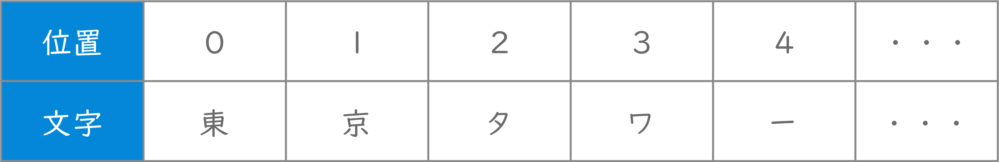
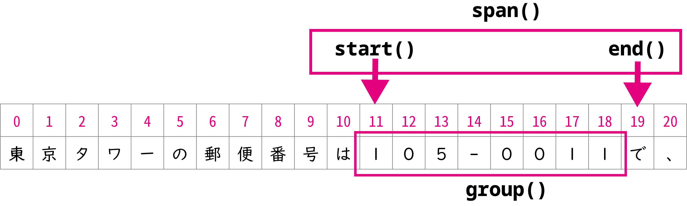

# コンピュータリテラシ発展 〜Pythonを学ぶ〜

## 第8回：Excel作業の前工程・後工程の自動化

情報学部 情報学科 情報メディア専攻
清水 哲也 ( shimizu@info.shonan-it.ac.jp )

---

<div Align=center>

# 今回の授業内容

</div>

---

# 今回の授業内容

- [前回の課題解説](#前回の課題解説)
- [文字列操作](#文字列操作)
- [CSVデータの処理](#csvデータの処理)
- [課題](#課題)

---

<div Align=center>

# 前回の課題解説

</div>

---

# 前回の課題解説

- 前回の課題の解答例を示します
- 解答例について質問があればご連絡ください

## 解答例


---

<div Align=center>

# 文字列操作

</div>

---

# 文字列操作

- Pythonで文字列の操作を行います
  - 文章から特定の情報の抽出や加工が簡単にできるようになります
  - **正規表現**を利用してより発展的な文字列検索などを可能にします
- 正規表現について詳しくかつわかりやすく説明しているサイト
  - https://www.tohoho-web.com/ex/regexp.html


---

# 文字列操作

- 文字列操作の前に対象となるテキストファイルとそれを置いておくフォルダを作成します
- Google Driveの授業用フォルダに「**text_search**」というフォルダを作成
- 「**text_search**」フォルダに「**file.txt**」ファイルを作成
- ファイル内容は以下の通りです

```shell
東京タワーの郵便番号は105-0011で、東京スカイツリーの郵便番号は131-0045です。
```

---

# 文字列操作

- 文字列操作の前に対象となるテキストファイルとそれを置いておくフォルダを作成します

```py
import os
# 作業場所に「text_search」フォルダを作成する
os.makedirs('/content/drive/MyDrive/???/text_search', exist_ok=True)

# 「text_search」フォルダに「file.txt」ファイルを作成して文章を入力する
with open('/content/drive/MyDrive/???/text_search/file.txt', 'x') as f:
  f.write('東京タワーの郵便番号は105-0011で、東京スカイツリーの郵便番号は131-0045です。')
```

---

# 文字列操作

- 文字列がふくまれるかどうかを判定
- **in演算子**
  - 任意の文字列が含まれるかどうかを判定
  - 含まれる場合：**True**
  - 含まれない場合：**False**

---

# 文字列操作

- 文字列が含まれている位置を判定
- **`find()`メソッド**
  - 任意の文字列が含まれる開始位置を返す
  - 開始位置は「**0**」から数え始める



---

# 文字列操作

- 文字列検索を使って「タワー」という文字列の有無と開始位置を検索
- 文字列がふくまれるかどうかを判定 ： **in演算子**
- 文字列の開始位置を判定 ： **`find()`メソッド**

```py
with open('/content/drive/MyDrive/???/text_search/file.txt', encoding='UTF-8') as f:
  text = f.read()

if 'タワー' in text:
  fd = text.find('タワー')
  print('タワーという文字列が' + str(fd + 1) + '字目に含まれています')
else:
  print('タワーという文字列は含まれていません')
```

---

# 正規表現を使って文字列を検索

- 正規表現とは
  - 文字列のパターンを表現する記述方法
  - 参考サイト
    - https://w.wiki/5SGg
    - https://docs.python.org/ja/3/library/re.html
    - https://www.tohoho-web.com/ex/regexp.html


---

# 正規表現を使って文字列を検索

- 正規表現とは
  - 「**^**(キャレット)」「**.**(ピリオド)」「**\***(アスタリスク)」「**\d**」などの特別な意味を持ったメタ文字と通常の文字（リテラル）の組み合わせで表現します
  - メタ文字はたくさんの種類があります

---

# メタ文字の種類と意味

<div Align=center>

| 表現 |                         意味                          |
| ---- | ----------------------------------------------------- |
| .    | 改行を除くすべての文字のいずれか1文字                 |
| *    | 直前の文字を0回以上繰り返し（0回=その文字がない場合） |
| {N}  | 直前のパターンのN回の連続                             |
| ^    | 行頭の位置                                            |
| $    | 行末の位置                                            |
| A\|B | AかBのいずれか1文字                                   |

</div>

---

# メタ文字の種類と意味

<div Align=center>

| 表現  |                               意味                               |
| ----- | ---------------------------------------------------------------- |
| [X]   | []内に指定した文字のいずれか1文字                                |
| [X-Y] | []内「-」の左右に指定した文字の，文字コード範囲内のいずれか1文字 |
| [^X]  | []内に指定した文字X以外のいずれか1文字                           |
| \d    | 数字１文字，[0-9]と同義                                          |
| \D    | 数字以外の文字列の１文字                                         |
| \w    | すべてのアルファベットとアンダースコアのいずれか１文字           |

</div>

---

# 正規表現を使って文字列を検索

- 正規表現の使いかた
  - メタ文字を使ってみましょう
  - 郵便番号は「**数字３桁-数字４桁**」で構成されています
  - メタ文字を使うと「**`\d\d\d-\d\d\d\d`**」となります
  - 環境によっては「**\ (バックスラッシュ)**」は「**￥ (円マーク)**」で表示されます

---

# 正規表現を使って文字列を検索

- Pythonで正規表現を扱う
  - `re`モジュール
    - regular expressionの略
    - インストール済み
    - インポート必要

---

# 正規表現を使って文字列を検索

- Pythonで正規表現を扱う
  - `re`モジュール
    - `findall()`関数
      - マッチした文字列をリストで取り出す
      - 第１引数：検出する正規表現
      - 第２引数：検索対象となる文字列

---

# 正規表現を使って文字列を検索

- Pythonで正規表現を扱う
  - `re`モジュール
    - `findall()`関数
      - **raw**文字列記述
        - エスケープシーケンスをそのままの文字として扱う
        - 「\」を使う場合は，raw文字列記述を使うのが一般的

---

# 正規表現を使って文字列を検索

- Pythonで正規表現を扱う
  - `re`モジュールの`findall()`関数
  
```py
import re # reモジュールをインポート

# 検索対象のファイルのパスを指定
file_path = '/content/drive/MyDrive/???/text_search/file.txt'

# ファイルをUTF-8エンコーディングで読み込みモードで開く
with open(file_path, encoding='UTF-8') as f:
  # ファイルの内容を読み取り、正規表現を使って郵便番号のリストを抽出
  # 正規表現 r'\d\d\d-\d\d\d\d' は 'xxx-xxxx' 形式の郵便番号にマッチする
  postal_code_list = re.findall(r'\d\d\d-\d\d\d\d', f.read())

# 抽出された郵便番号のリストを表示
print(postal_code_list)
```

---

# 正規表現を使って文字列を検索

- Pythonで正規表現を扱う
  - `re`モジュール
    - `compile()`関数
      - 正規表現オブジェクトをつくれる
      - つくったオブジェクトは何度も使える

---

# 正規表現を使って文字列を検索

- Pythonで正規表現を扱う
  - `re`モジュールの`compile()`関数

```py
import re

file_path = '/content/drive/MyDrive/???/text_search/file.txt'

# 郵便番号を表す正規表現パターンをオブジェクト化
# 正規表現 r'\d\d\d-\d\d\d\d' は 'xxx-xxxx' 形式の郵便番号にマッチする
postal_code_regex = re.compile(r'\d\d\d-\d\d\d\d')

with open(file_path, encoding='UTF-8') as f:
  # ファイルの内容を読み取り、正規表現を使って郵便番号のリストを抽出
  postal_code_list = postal_code_regex.findall(f.read())

print(postal_code_list)
```

---

# 正規表現を使って文字列の位置を調べる

- 正規表現で検索一致した最初の文字列の位置を求めます
- `search()`関数
  - 検索一致した文字列の位置を返す
  - 第１引数：正規表現パターン
  - 第２引数：検索対象文字列

---

# 正規表現を使って文字列の位置を調べる

- 正規表現で検索一致した最初の文字列の位置を求める
- `search()`関数

```py
import re

file_path = '/content/drive/MyDrive/???/text_search/file.txt'

with open(file_path, encoding='UTF-8') as f:
  # ファイルの内容を読み取り、正規表現を使って最初にマッチする郵便番号を検索
  # 正規表現 r'\d\d\d-\d\d\d\d' は 'xxx-xxxx' 形式の郵便番号にマッチする
  print(re.search(r'\d\d\d-\d\d\d\d', f.read()))
```

---

# 正規表現を使って文字列の位置を調べる

- 正規表現で検索一致した文字列の位置を求める
- `search()`メソッド
  - マッチオブジェクト
    - `group()`:マッチした文字列
    - `start()`:開始位置
    - `end()`：終了位置
    - `span()`:開始位置と終了位置をタプルで取り出す

---

# 正規表現を使って文字列の位置を調べる

- 正規表現で検索一致した文字列の位置を求める
- `search()`メソッドとマッチオブジェクト

```py
file_path = '/content/drive/MyDrive/???/text_search/file.txt'
postal_code_regex = re.compile(r'\d\d\d-\d\d\d\d')

with open(file_path, encoding='UTF-8') as f:
  # ファイルの内容を読み取り、正規表現を使って最初にマッチする郵便番号を検索
  postal_code_match = postal_code_regex.search(f.read())

  if postal_code_match:   # マッチする郵便番号が見つかった場合
    print(postal_code_match)          # マッチした結果のMatchオブジェクトを表示
    print(postal_code_match.group())  # マッチした文字列自体を表示
    print(postal_code_match.start())  # マッチした文字列の開始位置を表示
    print(postal_code_match.end())    # マッチした文字列の終了位置を表示
    print(postal_code_match.span())   # マッチした文字列の開始位置と終了位置のタプルを表示
```

---

# 正規表現を使って文字列の位置を調べる

- 正規表現で検索一致した文字列の位置を求める
- `search()`メソッドとマッチオブジェクト



---

# 文字列の置換

- 検索してヒットした文字列を別の文字列に置き換えます
- `sub()`関数
  - 第１引数：検索パターン
  - 第２引数：置換後文字列
  - 第３引数：対象のテキスト

---

# 文字列の置換

- 検索してヒットした文字列を別の文字列に置き換える
- `sub()`関数
- 「**東京**」を「**Tokyo**」に置き換える

```py
import re

file_path = '/content/drive/MyDrive/???/text_search/file.txt'

with open(file_path, encoding='UTF-8') as f:
  # ファイルの内容をすべて読み取り、正規表現を使って文字列を置換
  # '東京' という文字列を 'Tokyo' に置換する
  text_mod = re.sub('東京', 'Tokyo', f.read())

  # 置換後のテキストを表示
  print(text_mod)
```

---

<div Align=center>

# CSVデータの処理

</div>

---

# CSVの出力

- CSVファイルとは
  - Comma-Separated Valuesの略
  - 区切り文字であるカンマ「,」で区切ったデータ形式です
- `csv`モジュール
  - pythonでCSVを操作を行うにはcsvモジュールを利用します
  - インストール済み，インポート必要

---

# CSVの出力

- 「**CSV**」フォルダを作成して**CSV**ファイルを作成します
- **CSV**ファイルにデータを書き込むには`writer()`関数を使用します
- `writer()`関数の引数にファイルオブジェクトと`delimiter`をわたします
- `delimiter`は，区切り文字のことでデフォルトでは「`,`」を使用します
- `writerow()`メソッドはリストを引数として指定し，行単位でCSVに出力します

---

# CSVの出力

- 「**CSV**」フォルダを作成して「**sample.csv**」ファイルを作成します

```py
import os, csv # os, csvモジュールをインポート

# CSVファイルを保存するためのフォルダのパスを指定
path = '/content/drive/MyDrive/???/CSV/'

# 指定されたパスにフォルダを作成．既に存在する場合はエラーを出さずに無視する
os.makedirs(path, exist_ok=True)

# 'sample.csv'ファイルを新規作成モード ('x') で開き，改行コードを指定してファイルオブジェクトを取得
with open(path + 'sample.csv', 'x', newline='') as f:
  # csv.writerオブジェクトを作成し，カンマ区切り (delimiter=',') に設定
  w = csv.writer(f, delimiter=',')
  # 1行目のデータ ['1', '2', '3'] をCSVファイルに書き込む
  w.writerow(['1', '2', '3'])
  # 2行目のデータ ['4', '5', '6'] をCSVファイルに書き込む
  w.writerow(['4', '5', '6'])
```

---

# CSVの読み込み

- CSVファイルの読み込みには`csv`モジュールの`Reader`オブジェクトを使用します
- CSVファイルの各行をリストのイテラブルとして扱うことができます

```py
import csv

file_path = '/content/drive/MyDrive/???/CSV/sample.csv'

# CSVファイルを読み取りモード ('r') で開く
with open(file_path, 'r', newline='') as f:
  # csv.readerオブジェクトを作成
  r = csv.reader(f)

  # CSVファイルの各行を反復処理
  for row in r:
    # 各行の内容を表示
    print(row)

```

---

# CSVの加工

- CSVファイルの読み込みと出力ができるようになったのでデータの加工に挑戦します
- データの加工方法は色々ありますがここでは後に詳しく説明する`pandas`ライブラリを使用します
- `pandas`ライブラリではCSVファイルの読み込み・出力もできます

---

# CSVの加工

- pandasを使ってCSVファイルを読み込む：`read_csv()`関数
- CSVを読み込み，`DataFrame`というオブジェクトを作成します
- `DataFrame`は表形式のデータ構造をもち，行番号0のデータを書き換えるときは「`df.loc[0]=[‘10’,’20’,’30’]`」と書きます
- `to_csv()`メソッドでCSVファイルに書き出して処理が完了します
- 「`index=False`」「`header=None`」は読み込みの際に自動で付与される情報を無効にする設定です

---

# CSVの加工

- pandasを使ってCSVを読み込み，データを加工して出力する

```py
import pandas as pd # pandasモジュールをインポート

path = '/content/drive/MyDrive/???/CSV/'

# 'sample.csv'ファイルを読み込み、データフレームに格納
# header=None はCSVファイルにヘッダー行がないことを示す
df = pd.read_csv(path + 'sample.csv', header=None)
# データフレームの最初の行（インデックス0）を新しいデータ ['10', '20', '30'] で置き換える
df.loc[0] = ['10', '20', '30']
# 変更されたデータフレームを新しいCSVファイル 'sample2.csv' に保存
# index=False は行番号を保存しないことを示す
# header=None はヘッダー行を保存しないことを示す
df.to_csv(path +'sample2.csv', index=False, header=None)

```

---

# CSVの加工

- pandasについては後の授業で解説します
- pandasはとても有用なライブラリでとても多くのことができます
- 授業ではそのほんの一部のみを扱います
- 詳しい情報を知りたい学生は公式やQiitaなどをみてみてください
- https://pandas.pydata.org/
- https://qiita.com/tags/pandas


---

<div Align=center>

# 課題

</div>

---

# 課題

- Moodleにある「SCfCL_08_prac.ipynb」ファイルをダウンロードしてColabにアップロードしてください
- 課題が完了したら「File」>「Download」>「Download .ipynb」で「.ipynb」形式でダウンロードしてください
- ダウンロードした **.ipynbファイル** と作成した「Prac09」フォルダを圧縮してMoodleに提出してください

## 提出期限は **11月21日(木) 20時まで** です
