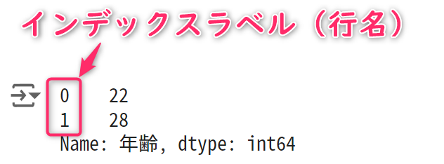

# コンピュータリテラシ発展 〜Pythonを学ぶ〜

## 第9回：表計算やデータ分析をやってみよう

情報学部 情報学科 情報メディア専攻
清水 哲也 ( shimizu@info.shonan-it.ac.jp )

---

<div Align=center>

# 今回の授業内容

</div>

---

# 今回の授業内容

- [前回の課題解説](#前回の課題解説)
- [データ分析を始める前に](#データ分析を始める前に)
- [pandasの使い方](#pandasの使い方)
- [課題](#課題)

---

<div Align=center>

# 前回の課題解説

</div>

---

# 前回の課題解説

- 前回の課題の解答例を示します
- 解答例について質問があればご連絡ください

## 解答例

https://colab.research.google.com/drive/1jzmLboQk88DJ6UWLEgX_sq_g8N8aLnkn?usp=sharing

---

<div Align=center>

# データ分析を始める前に

</div>

---

# ExcelとPythonの使い分け

### Excel
- 表計算ソフトウェアの直感的な使いやすさと普及率を持っており依然として頻繁に使用されます
### Python
- データ分析の利点はデータ収集や前処理の簡便さ，大規模なデータに対する軽快な操作，機械学習の得意分野があります
- JupyterLab（Google Colab）を使うことでデータ分析の過程を記録し共有が容易です
- データ分析を本業にしている人々はPythonやRというプログラミング言語を多く利用しています


---

# データ処理の流れ

- 大きく分けて**3ステップ**あります
- Pythonで各ステップを実施する際には,それぞれのステップで異なるライブラリを使用したり，組み合わせることが必要になります

[1. データ収集](#1-データ収集)
[2. 前処理](#2-前処理)
[3. 集計・可視化](#3-集計可視化)

---

# 1. データ収集
- 必要なデータを集めます
- 集める対象はWebであったり社内の各部署が管理しているファイル（デジタル，アナログ）です
- デジタルデータであれば，プログラムである程度は解決します
- アナログの場合は，プログラムだけでは解決しない事があり，その場合は，手作業のようなことをする必要があります

---

# 2. 前処理
- 集計・分析の前に処理がしやすいようにデータ形式を整えるなどの処理をします
- 例えば，欠損データをどう扱うかもその一つです
- 欠損データを「そのデータごと消してしまう」のか「代替となる値を代入する」のかを決める必要があります
- 代替データを代入するのであれば，そのデータをどのようにして生成するのか，そのロジックはどうするのかということも含まれます

---

# 3. 集計・可視化
-  分析の目的に応じ，データを集計し，グラフ化します
-  データを特定の基準で集めます


---

<div Align=center>

# pandasの使い方

</div>

---

# pandasの基本的な使い方

- pandasはPythonでデータ操作や分析を行う上で重要なライブラリです
- pandasを使うことで以下のようなことができます
  - データ操作
  - データ結合と操作
  - データの欠損値処理
  - 時系列データのサポート
  - データの入出力

公式サイト：https://pandas.pydata.org/
Qiita：https://qiita.com/tags/pandas

---

# pandasの基本的な使い方

- pandasはすでにGoogle Colabに入っているのでインストールの必要はありません
- インポートをする必要はあります
- 一般的にpandasは「`pd`」と省略して扱われます

```py
# pandasモジュールをインポートして「pd」と省略する
import pandas as pd
```

---

# pandasの基本的な使い方

- `Series`オブジェクト
  - 一次元のコンテナです
  - コンテナ：オブジェクトの集まりを表現するデータ構造のこと
- `DataFrame`オブジェクト
  - Excelのような表形式のデータを扱います
  - 行や列として一次元のデータ構造（`Series`オブジェクト）の集まりを，表形式のデータ構造(`DataFrame`オブジェクト)で扱います

---

# `DataFrame`と`Series`オブジェクト
- 名前データを扱う一次元データ（Series）を作成します

```py
#一度インポートしたら毎回書かなくてもよい
import pandas as pd

# 名前のリストを元にpandasのSeriesオブジェクトを作成
# Seriesは一列のデータを扱うためのデータ構造
name_series = pd.Series(['田中', '北野'])

# 作成したSeriesオブジェクトを表示
print(name_series)
```

---

# `DataFrame`と`Series`オブジェクト
- 年齢データを追加して１次元データの集まり（DataFrame）を作成します
- 見出しとなる「**名前**」「**年齢**」を追加します

```py
# 名前と年齢のデータを含むデータフレームを作成
# '名前' 列には事前に定義された Series オブジェクト 'name_series' を使用
# '年齢' 列には年齢のリスト [22, 28] を指定
people = pd.DataFrame({
    '名前': name_series,
    '年齢': [22, 28]
})

print(people)
```

---

# `DataFrame`と`Series`オブジェクト
- DataFrameは列単位でSeriesオブジェクトとして取り出すことができます

```py
import pandas as pd

# 先に作成されたデータフレーム 'people' の '年齢' 列を表示
print(people['年齢'])
```

---

# インデックスラベル（行名）
- これまでの結果からわかるように１番左の列に，「`０`」や「`１`」の数字が表示されます
- これを「**インデックスラベル（行名）**」と呼びます
- デフォルトでは「`0`」からはじまるので注意してください

<div Align=center>



</div>

---

# インデックスラベル（行名）
- `Series`オブジェクトや`DataFrame`オブジェクトの引数「`index`」を指定します
- これによりデフォルトでない値を使用することができます
- DataFrameオブジェクトでも同様に指定できます
- インデックスラベルは数字だけでなく，文字列を指定することもできます

```py
# 名前のリストを元にpandasのSeriesオブジェクトを作成
# '田中' と '北野' という名前のリスト
# インデックスラベルを [10, 20] に設定
# （デフォルトのインデックスラベルを使わずに指定したインデックスラベルを使用）
name_series = pd.Series(['田中', '北野'], index = [10, 20])

print(name_series)
```

---

# 行インデックス（行番号）
- インデックスラベルとは別に，「**行インデックス(行番号)**」も同様に指定することができます
- 行インデックスは，インデックスラベルのように別名をつけることができません
- １行目が「`0`」となるので注意してください

---

# `loc`と`iloc`属性によるデータの選択
- **loc属性**
  - ラベルを用いて行や列にアクセスするための属性
  - 行や列のラベルを指定して特定のデータにアクセスする際に使用
- **iloc属性**
  - インデックスを用いて行や列にアクセスするための属性
  - 行や列の位置（インデックス）を指定して特定のデータにアクセスする際に使用

---

# `loc`と`iloc`属性によるデータの選択
- 前準備としてDataFrameオブジェクトを作成する

```py
# 年齢、身長、体重のデータを含むデータフレームを作成
# '年齢', '身長', '体重' という列を持つデータフレーム
# インデックスラベルは ['田中', '北野', '高橋', '岡田', '長谷川'] に設定
people = pd.DataFrame({
    '年齢': [21, 34, 23, 44, 19],
    '身長': [180, 168, 174, 181, 169],
    '体重': [74, 61, 65, 82, 70]
},
    index=['田中', '北野', '高橋', '岡田', '長谷川'])

print(people)
```

---

# `loc`と`iloc`属性によるデータの選択
- インデックスラベルが「`北野`」のデータを取り出す方法（loc属性利用）
- 行インデックスが「`1`」のデータを取り出す方法(iloc属性利用）
- 同じ結果になります

```py
# '北野'という名前のインデックスラベルに対応する
# 行をデータフレーム 'people' から取得し、表示
print(people.loc['北野'])

# インデックス位置が1（2番目の行）に対応する
# 行をデータフレーム 'people' から取得し、表示
print(people.iloc[1])
```

---

# `loc`と`iloc`属性によるデータの選択
- 必要な列に絞って取得することも可能
- 結果は同じになります

```py
# '高橋'という名前のインデックスラベルに対応する行から、
# 特定の列（'年齢'と'体重'）を取得し、表示
print(people.loc['高橋', ['年齢', '体重']])

# インデックス位置が2（3番目の行）に対応する行から、
# 特定の列（0番目と2番目の列：'年齢'と'体重'）を取得し、表示
print(people.iloc[2, [0, 2]])
```

---

# `loc`と`iloc`属性によるデータの選択
- `[start:stop]`形式で取り出したい部分を指定できます
- これをスライス記法と呼ぶ
- 結果は同じになります

```py
# インデックスラベルが '高橋' から '長谷川' までの行を
# データフレーム 'people' から取得し、表示
# locプロパティを使用して、インデックスラベルで範囲を指定
print(people.loc['高橋':'長谷川'])

# インデックス位置が2から4（3番目から5番目の行）までの行を
# データフレーム 'people' から取得し、表示
# ilocプロパティを使用して、整数値で範囲を指定
print(people.iloc[2:5])
```

---

<div Align=center>

# 課題

</div>

---

# 課題

- Moodleにある「SCfCL_09_prac.ipynb」ファイルをダウンロードしてColabにアップロードしてください
- 課題が完了したら「File」>「Download」>「Download .ipynb」で「.ipynb」形式でダウンロードしてください
- ダウンロードした **.ipynbファイル** をMoodleに提出してください

## 提出期限は **11月28日(木) 20時まで** です
