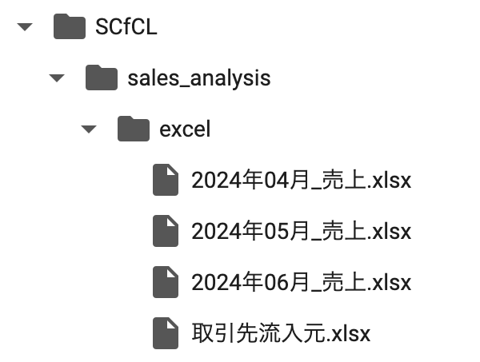
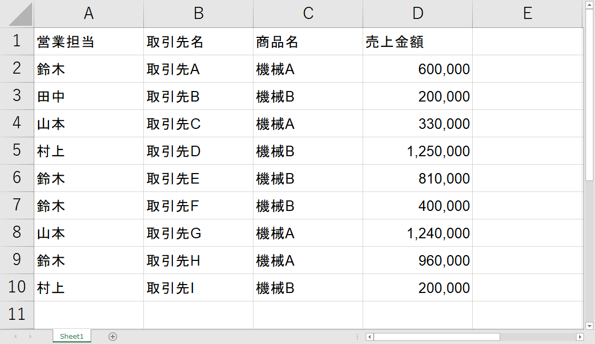
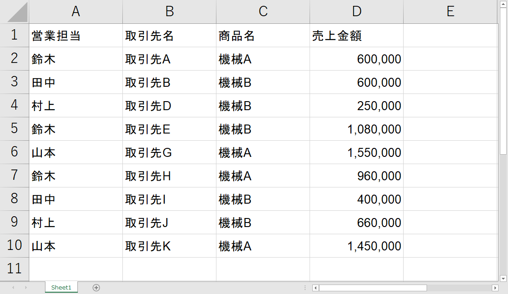
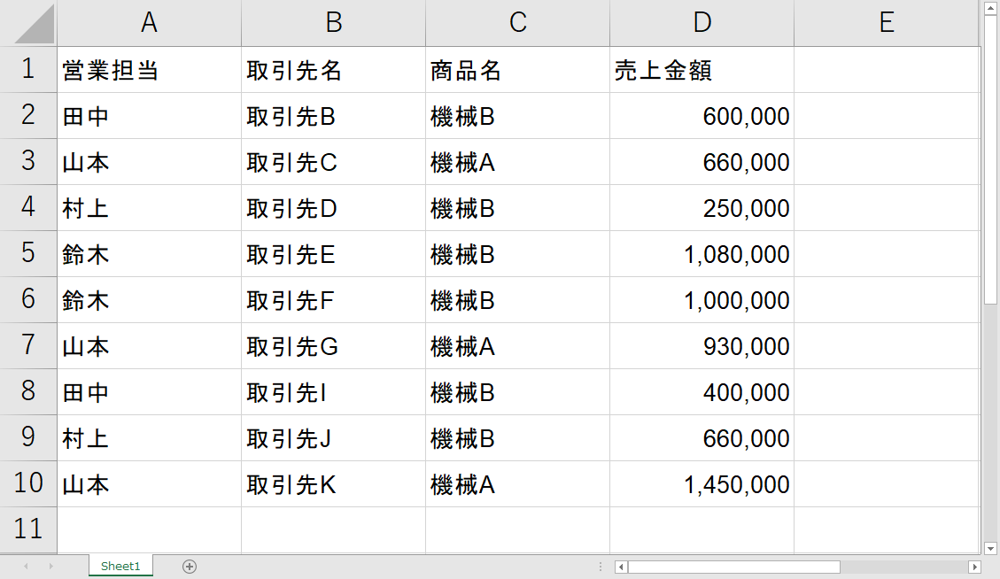
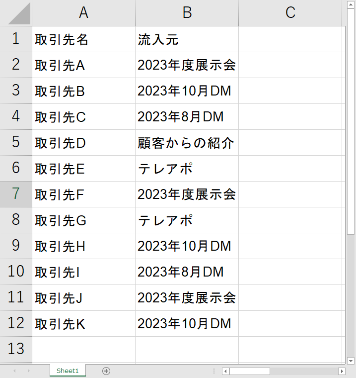

# コンピュータリテラシ発展 〜Pythonを学ぶ〜

## 第10回：いろんな業務を自動化してみよう

情報学部 情報学科 情報メディア専攻
清水 哲也 ( shimizu@info.shonan-it.ac.jp )

---

<div Align=center>

# 今回の授業内容

</div>

---

# 今回の授業内容

- [前回の課題解説](#前回の課題解説)
- [複数のExcelファイルに分散した売上データを分析する](#複数のexcelファイルに分散した売上データを分析する)
- [フォルダの中のExcelファイルを読み込む](#フォルダの中のexcelファイルを読み込む)
- [課題](#課題)

---

<div Align=center>

# 前回の課題解説

</div>

---

# 前回の課題解説

- 前回の課題の解答例を示します
- 解答例について質問があればご連絡ください

## 解答例

https://colab.research.google.com/drive/1aO3grSL9x91wbAIlWk_BQNqBOFKtRMB2?usp=sharing

---

<div Aign=center>

# 複数のExcelファイルに分散した売上データを分析する

</div>

---

# 目標

- 月ごとに分かれた売上データ（Excelファイル）を集計します
- 集計した売上データと顧客流入元データを結合します
- 顧客流入元ごとの売上合計を集計します

---

# データの準備

- これから行う分析のためにデータを準備します
- Moodleにある「[excel.zip](https://moodle2024.shonan-it.ac.jp/mod/resource/view.php?id=8713)」をダウンロードして解凍してください
- 作業場所に「**sales_analysis**」フォルダを作成してそこの「**excel**」フォルダをアップロードしてください．
- 「**sales_analysis**」の中に「**excel**」フォルダがあるようにしてください
- 「**excel**」フォルダの中身は以下の通りです
  - **2024年04月_売上.xlsx**
  - **2024年05月_売上.xlsx**
  - **2024年06月_売上.xlsx**
  - **取引先流入元.xlsx**

---

# データの準備

Colab上でGoogle Driveのフォルダ構成は以下のようになります．

<div Align=center>



</div>

---

# 各ファイルの中身

<div Align=center>

|    2024年04月_売上.xlsx    |    2024年05月_売上.xlsx    |
| -------------------------- | -------------------------- |
|  |  |


</div>

---

# 各ファイルの中身

<div Align=center>

|    2024年06月_売上.xlsx    |     取引先流入元.xlsx      |
| -------------------------- | -------------------------- |
|  |  |

</div>

---

# pythonファイルの作成

- 今回は，Pythonファイル(.ipynb)を先程作成した「**sales_analysis**」ファルダ内に作成します
- ファイル名は自由に決めてください
- 例：`SCfCL_11_Lecture.ipynb` など

---

<div Align=center>

# フォルダの中のExcelファイルを読み込む

</div>

---

# 対象ファイルの一覧を取得

- ExcelファイルをすべてPythonで読み込みます
- 「excel」フォルダ内のファイルの一覧を取得します

```py
# osモジュールをインポート
import os

# Excelファイルが保存されているフォルダのパスを指定
folder_path = '/content/drive/MyDrive/???/sales_analysis/excel/'

# 指定されたフォルダ内のファイル一覧を取得
excel_files = os.listdir(folder_path)

# 取得したファイル一覧を表示
excel_files
```

---

# 売上データを読み込み

- Excelファイル内の売上データのみを読み込みます
- pandasでExcelファイルを読み込むには`read_excel()`関数を使用します


```py
# pandasモジュールをインポート
import pandas as pd

# 空のリストを作成、売上データを格納するためのリスト
list_sales_data = []

# フォルダ内のファイル一覧をループで処理
for excel_file in excel_files:
    # ファイル名に '売上' が含まれている場合に処理を実行
    if '売上' in excel_file:
        # Excelファイルを読み込み、データフレームに格納
        sales_data = pd.read_excel(folder_path + excel_file)
        # データフレームをリストに追加
        list_sales_data.append(sales_data)

list_sales_data
```

---

# 取引先流入元データの読み込み

- Excelファイル内の取引先流入元データのみを読み込みます
- 対象ファイルが1つしかないので直接ファイル名を指定します

```py
# '取引先流入元.xlsx' ファイルのパスを指定
sales_channel_file = folder_path + '取引先流入元.xlsx'

# 指定されたExcelファイルを読み込み、データフレームに格納
sales_channel = pd.read_excel(sales_channel_file)

# 読み込んだデータフレームの内容を表示
sales_channel
```

---

# 各月ごとに分かれている売上データを連結する

---

# 各月ごとに分かれている売上データを連結する

- 読み込んだ売上データを`concat()`関数を使って連結します

```py
# list_sales_dataリストに格納されたすべてのデータフレームを結合し、
# 1つのデータフレームにまとめる
# ignore_index=True は、結合後のデータフレームの
# インデックスを再設定することを示す
sales_summary = pd.concat(list_sales_data, ignore_index=True)

# 結合されたデータフレームの内容を表示
sales_summary
```

---

# プログラムをまとめる

- Google Colabを利用している場合はまとめてもまとめまなくてもいいと思います
- 自分のパソコンでpythonファイルを作成して実行する場合は1つのファイルにまとめた方がいいです
- 一連の処理は関数にまとめると処理の内容がわかりやすいです

https://colab.research.google.com/drive/1QF6ll_Gug0DibzXuOj_YJ1Rv802O8rGZ?usp=sharing

---

# 売上データと顧客流入元データを結合する

---

# 売上データと顧客流入元データを結合する

- 売上データと顧客流入元データを結合します
- 2つのデータには「**取引先名**」があるのでこれをキーにします
- pandasの`merge()`関数を使用します

```py
# sales_channelデータフレームとsales_summaryデータフレームを '取引先名' 列でマージ
# '取引先名' 列の値が一致する行を結合して、新しいデータフレームを作成
summary = pd.merge(sales_channel, sales_summary, on='取引先名')

# マージされたデータフレームの内容を表示
summary
```

---

# 顧客流入元ごとの売上合計を集計する

---

# 顧客流入元ごとの売上合計を集計する

- 「**流入元**」をキーにして集計します
- `groupby()`メソッドを使います
- 売上合計なので`GroupBy`オブジェクトの`sum()`メソッドを使います
- `sum()`の引数として`numeric_only=True`をいれます

```py
# summaryデータフレームを '流入元' 列でグループ化し、数値列の合計を計算
# numeric_only=True を指定して、数値列のみを対象にする
sales_by_channel = summary.groupby('流入元').sum(numeric_only=True)

# グループ化されたデータフレームの内容を表示
sales_by_channel
```

---

# Excelファイルに集計データを出力する

---

# Excelファイルに集計データを出力する

- 出力するもの
  - 売上データと顧客流入元データを結合したデータ（`summary`）
  - 流入元ごとの売上データ（`sales_by_channel`）
- pandasでExcelに書き出す時に複数シートにデータを書き出すには`ExcelWriter`オブジェクトを利用する
- `to_excel()`メソッドで1シートずつ書き出します

---

# Excelファイルに集計データを出力する

- 出力先は「**sales_analysis**」フォルダに指定します
- `output_path`に出力先フォルダを設定します

```py
# 出力ファイルのパスを指定
output_path = '/content/drive/MyDrive/???/sales_analysis/'

# ExcelWriterを使用して、複数のデータフレームを1つのExcelファイルに保存
with pd.ExcelWriter(output_path + 'summary.xlsx') as writer:
    # summaryデータフレームを '売上サマリー' シートに書き込み
    summary.to_excel(writer, sheet_name='売上サマリー')
    
    # sales_by_channelデータフレームを '流入元ごとの売上' シートに書き込み
    sales_by_channel.to_excel(writer, sheet_name='流入元ごとの売上')
```

---

# プログラムをまとめる

- Google Colabを利用している場合はまとめてもまとめまなくてもいいと思います
- 自分のパソコンでpythonファイルを作成して実行する場合は1つのファイルにまとめた方がいいです
- 一連の処理は関数にまとめると処理の内容がわかりやすいです

https://colab.research.google.com/drive/1f0tVeGPE-746AZeAuwscT2cunXKAuvIS?usp=sharing

---

<div Align=center>

# 課題

</div>

---

# 課題

- 今回の授業でやったことを提出してください
- 課題が完了したら「File」>「Download」>「Download .ipynb」で「.ipynb」形式でダウンロードしてください
- ダウンロードした **.ipynbファイル** をMoodleに提出してください

## 提出期限は **12月12日(木) 20時まで** です
