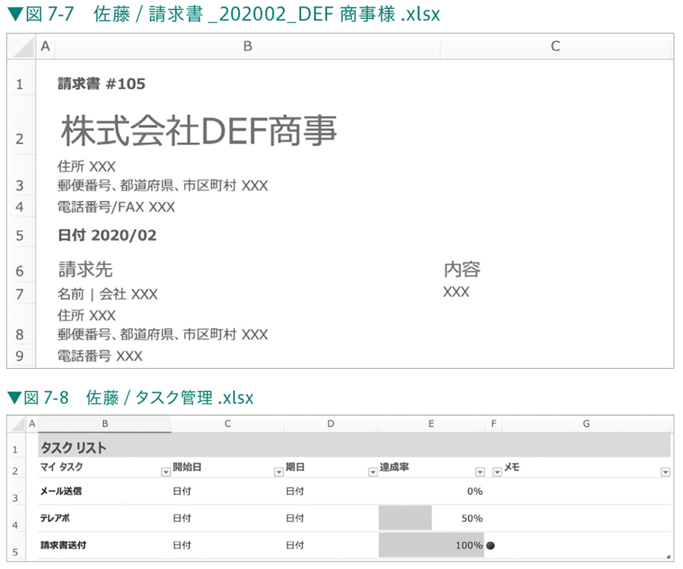
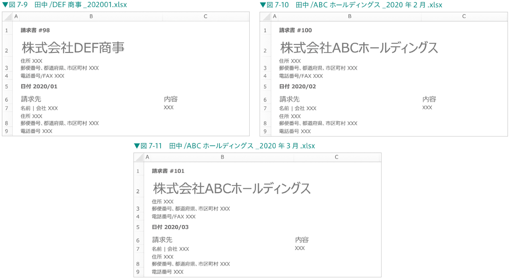
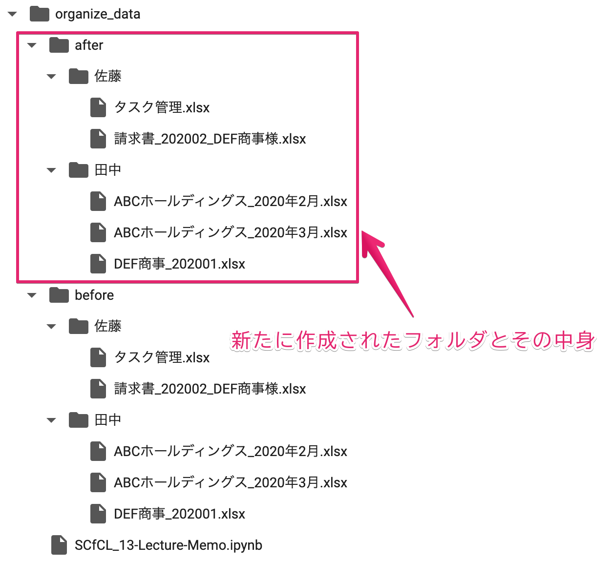

# コンピュータリテラシ発展 〜Pythonを学ぶ〜

## 第12回：いろんな業務を自動化してみよう(2)

情報学部 情報学科 情報メディア専攻
清水 哲也 ( shimizu@info.shonan-it.ac.jp )

---

<div Align=center>

# 今回の授業内容

</div>

---

# 今回の授業内容

- [特定のルールに従ってフォルダ構成を整理する](#特定のルールに従ってフォルダ構成を整理する)
- [新しいフォルダにすべてのファイルをコピーする](#新しいフォルダにすべてのファイルをコピーする)
- [すべてのファイルを取得する](#すべてのファイルを取得する)
- [取得したファイルが請求書ファイルかどうかを判別する](#取得したファイルが請求書ファイルかどうか判別する)
- [新しいファイル名とフォルダ名を取得する](#新しいファイル名とフォルダ名を取得する)
- [新しいフォルダを作成する](#新しいフォルダを作成する)
- [ファイル名変更とフォルダ移動を行う](#ファイル名変更とフォルダ移動を行う)
- [課題](#課題)

---

<div Aign=center>

# 特定のルールに従ってフォルダ構成を整理する

</div>

---

# データの準備

- これから行う分析のためにデータを準備します
- Moodleにある「[before.zip](https://moodle2024.shonan-it.ac.jp/mod/resource/view.php?id=33140)」をダウンロードして解凍してください
- 作業場所に「**organize_data**」フォルダを作成し,そのフォルダ内に「**before**」フォルダをアップロードしてください．
- 「**organize_data**」の中に「**before**」フォルダがあり，beforeフォルダ内に「佐藤」と「田中」フォルダがあります

---

# Colab(.ipynb)ファイルの作成

- 今回はColabファイル（.ipynb）を先程作成せいた「**organize_data**」フォルダ内に作成します
- ファイル名は自由に決めてください
- 例：`Lecture12.ipynb` など


---

# データの準備

Colab上のフォルダ構成は以下のようになります

<div Align=center>


</div>

---

# 問題点と目標

## 問題点

- ファイルとフォルダの管理ルールが不適切
- 請求書のファイル名が不規則かつ，ファイルが分散している

## 目標

- 請求書は「請求書_会社名+様+YYYY年MM月」に統一
- お客様の会社ごとにフォルダを作成
- 請求書以外のファイルは移動操作を行わない


---

# 「佐藤」フォルダの各ファイルの中身

<div Align=center>



</div>

---

# 「田中」フォルダの各ファイルの中身

<div Align=center>



</div>

---

<div Align=center>

# 新しいフォルダにすべてのファイルをコピーする

</div>

---

# 新しいフォルダにすべてのファイルをコピーする

- ファイル名の変更等作業時にファイル誤削除の危険があるため，まず作業用フォルダを作成します
- 作業用フォルダは「**after**」という名前で作成します
- すべてのファイルをこの作業用フォルダにコピーします
- フォルダのコピーは `shutil` モジュールの `copytree()` 関数を利用します
- 同じ処理を2回実行すると2回目はフォルダが既に存在するためエラーが発生します
- プログラムを何度実行してもエラーが処理が終了しないように例外処理を組み込みます

---

# 新しいフォルダにすべてのファイルをコピーする


```py
# shutilモジュールをインポート
import shutil
# organize_dataフォルダパスを指定
org_path = '/content/drive/MyDrive/???/organize_data/'

try:
  # 「before」フォルダを「after」フォルダにコピー
  shutil.copytree(org_path + 'before', org_path + 'after')

# FileExistsErrorが発生した場合のエラーハンドリングを行う
# ここでは「after」フォルダがすでに存在する場合にこのエラーが発生
except FileExistsError as e:
  # 「after」フォルダがすでに存在する場合のエラーメッセージを表示
  print('すでにafterフォルダが存在します')
```

---

# 新しいフォルダにすべてのファイルをコピーする

結果は左のようになります



---

<div Align=center>

# すべてのファイルを取得する

</div>

---

# すべてのファイルを取得する

- 「**after**」フォルダ内のすべてのファイルを取得します
- 請求書ファイルは「**佐藤**」と「**田中**」のフォルダに分かれています
- `os`モジュールの`listdir()`関数を使用するとフォルダ名のみ取得しファイル名は一度に取得できません
- 今回の場合`glob`モジュールを用いた再帰的な検索を行います

---

# すべてのファイルを取得する

取得したファイルリストを表示します

```py
# globモジュールをインポート
import glob

# 「after」フォルダ内のすべてのファイルとディレクトリを再帰的に取得
files = glob.glob(org_path + 'after/**', recursive=True)

# 取得したファイルとディレクトリのリストを表示
files
```

---

<div Align=center>

# 取得したファイルが請求書ファイルかどうか判別する

</div>

---

# 取得したファイルが請求書ファイルかどうか判別する

-  「**請求書以外のファイルは移動しない**」というルールに従いファイルが請求書かどうかを判別する処理が必要になります
-  請求書ファイルかどうかを判断するためExcelファイルのシート名に「**請求書**」が含まれているかを確認します
-  この確認作業には`OpenPyXL`ライブラリを利用する

---

# 拡張子が「.xlsx」かどうかの確認

- OpenPyXLを使用するにはファイルの拡張子が「**.xlsx**」である必要があります
- OpenPyXLを使用して開けるファイルかどうかを確認する処理を実施します

```py
# Excelファイルかどうかをチェックする関数を定義
def check_excel_file(file):
    # ファイル名に '.xlsx' が含まれているかをチェック
    if '.xlsx' in file:
        return True  # Excelファイルである
    else:
        return False  # Excelファイルではない

# ファイルリストをループで処理
for file in files:
    # ファイルがExcelファイルかどうかをチェック
    if check_excel_file(file):
        # Excelファイルの場合のメッセージを表示
        print('「' + file + '」はExcelです．')  
    else:
        # Excelファイルではない場合のメッセージを表示
        print('「' + file + '」はExcelではないです．')  
```

---

# シート名が「請求書」かどうかを確認

- 請求書かどうかを判断する処理を行います
- Excelファイルのシート名を取得する`sheetnames`属性を指定します

---

# シート名が「請求書」かどうかを確認

```py
# openpyxlモジュールをインポート
import openpyxl

# チェックするシート名を指定
invoice_sheet_name = '請求書'

# 指定されたExcelファイルに請求書シートがあるかどうかをチェックする関数を定義
def check_invoice_excel_file(wb):
    # ワークブックのシート名一覧に '請求書' が含まれているかをチェック
    if invoice_sheet_name in wb.sheetnames:
        return True  # '請求書' シートがある
    else:
        return False  # '請求書' シートがない

# ファイルリストをループで処理
for file in files:
    # ファイルがExcelファイルかどうかをチェック
    if check_excel_file(file):
        # Excelファイルを読み込む
        wb = openpyxl.load_workbook(file)
        # ワークブックに請求書シートがあるかどうかをチェック
        if check_invoice_excel_file(wb):
            print('「' + file + '」は請求書です．')  # 請求書シートがある場合のメッセージを表示
        else:
            print('「' + file + '」は請求書ではないです．')  # 請求書シートがない場合のメッセージを表示
    else:
        print('「' + file + '」はExcelではないです．')  # Excelファイルではない場合のメッセージを表示
```

---

<div Align=center>

# 新しいファイル名とフォルダ名を取得する

</div>

---

# 新しいファイル名とフォルダ名を取得する

- 新しい請求書ファイル名のフォーマットは「**請求書_会社名+様_YYYY年MM月**」とします
- 「**YYYY年MM月**」は請求書の発行年月を表します
- **会社名**と**請求書発行年月**はExcelファイルの**B2セル**と**B5セル**からそれぞれ取得します

---

# 会社名を取得する

- OpenPyXLで請求書シートの**B2セル**の値を`name`と名付けてとりだします

```py
# チェックするセルの位置を指定
corporate_name_cell = 'B2'

# ワークブックから請求書シートの企業名を取得する関数を定義
def get_invoice_corporate_name(wb):
    # '請求書' シートの指定されたセルの値を取得
    name = wb[invoice_sheet_name][corporate_name_cell].value
    return name  # 取得した企業名を返す

# ファイルリストをループで処理
for file in files:
    # ファイルがExcelファイルかどうかをチェック
    if check_excel_file(file):
        # Excelファイルを読み込む
        wb = openpyxl.load_workbook(file)
        # ワークブックに請求書シートがあるかどうかをチェック
        if check_invoice_excel_file(wb):
            # 請求書シートの企業名を取得
            name = get_invoice_corporate_name(wb)
            # 企業名を表示
            print(name)
```

---

# 請求書の発行年月を取得する

- 請求書発行月の取得はExcelファイルのB5セルから取得します
- B5セルの値は「**日付 YYYY/MM**」というフォーマットになっています
- 正規表現「`\d\d\d\d/\d\d`」を用いて「**YYYY/MM**」という必要な情報のみを「`date`」という名前で取り出します

---

# 請求書の発行年月を取得する(1/2)

```py
import re  # reモジュールをインポート（正規表現操作を行うためのモジュール）

# チェックするセルの位置を指定
invoice_created_date_cell = 'B5'

# ワークブックから請求書シートの作成日を取得する関数を定義
def get_invoice_created_date(wb):
    # '請求書' シートの指定されたセルの値を取得
    value = wb[invoice_sheet_name][invoice_created_date_cell].value

    # 作成日を抽出するための正規表現パターンを定義
    invoice_created_date_regex = re.compile(r'\d\d\d\d/\d\d')
    # 正規表現パターンにマッチする部分を検索
    invoice_created_date_match = invoice_created_date_regex.search(value)

    # マッチした部分を取得
    date = invoice_created_date_match.group()
    return date  # 取得した日付を返す
```

---

# 請求書の発行年月を取得する(2/2)

```py
# ファイルリストをループで処理
for file in files:
    # ファイルがExcelファイルかどうかをチェック
    if check_excel_file(file):
        # Excelファイルを読み込む
        wb = openpyxl.load_workbook(file)
        # ワークブックに請求書シートがあるかどうかをチェック
        if check_invoice_excel_file(wb):
            # 請求書シートの作成日を取得
            date = get_invoice_created_date(wb)
            # 作成日を表示
            print(date)
```

---

# 請求書ファイル名をフォーマット通りの形にする

- 会社名と請求書発行月を取得した後`format()`メソッドを使用してこれらの情報を結合します
- `get_invoice_created_date()`関数で取得した日付のフォーマット（例：2020/02）を最終的なフォーマット（例：2020年02月）に変換します
- 日付フォーマットの変換には**スライス記法**を利用します

---

# 請求書ファイル名をフォーマット通りの形にする(1/2)

```py
# ワークブックから新しい請求書ファイル名を生成する関数を定義
def get_new_invoice_file_name(wb):
    # 企業名と作成日を取得
    invoice_corporate_name = get_invoice_corporate_name(wb)
    invoice_created_date = get_invoice_created_date(wb)

    # 作成日をフォーマットする
    formatted_date = '{0}年{1}月'.format(invoice_created_date[0:4], invoice_created_date[5:7])

    # 新しいファイル名を生成する
    file_name = '請求書_{0}様_{1}'.format(invoice_corporate_name, formatted_date)
    file_name_with_ext = file_name + '.xlsx'
    return file_name_with_ext, invoice_corporate_name  # 新しいファイル名と企業名を返す
```

---

# 請求書ファイル名をフォーマット通りの形にする(2/2)

```py
# ファイルリストをループで処理
for file in files:
    # ファイルがExcelファイルかどうかをチェック
    if check_excel_file(file):
        # Excelファイルを読み込む
        wb = openpyxl.load_workbook(file)
        # ワークブックに請求書シートがあるかどうかをチェック
        if check_invoice_excel_file(wb):
            # 新しい請求書ファイル名を生成する
            new_file_name, new_dir_name = get_new_invoice_file_name(wb)
            # 新しいファイル名と企業名を表示する
            print(new_file_name, new_dir_name)
```

---

<div Align=center>

# 新しいフォルダを作成する

</div>

---

# 新しいフォルダを作成する

- 会社名のフォルダ作成には`os`モジュールの`makedirs()`関数を使用します
- フォルダ作成処理は請求書ファイルの数だけ複数回実行されます
- 既に存在するフォルダで処理が失敗しないように引数`exist_ok`を`True`に設定します

---

# 新しいフォルダを作成する

```py
import os

# 新しい請求書ディレクトリを作成する関数を定義
def make_new_invoice_dir(invoice_corporate_name):
    # 新しいディレクトリのパスを組み立てる
    dir_path = org_path + 'after/' + invoice_corporate_name
    # 新しいディレクトリを作成（存在する場合はエラーを無視）
    os.makedirs(dir_path, exist_ok=True)
    return dir_path  # 新しいディレクトリのパスを返す

# ファイルリストをループで処理
for file in files:
    # ファイルがExcelファイルかどうかをチェック
    if check_excel_file(file):
        # Excelファイルを読み込む
        wb = openpyxl.load_workbook(file)
        # ワークブックに請求書シートがあるかどうかをチェック
        if check_invoice_excel_file(wb):
            # 新しい請求書ファイル名を生成する
            new_file_name, new_dir_name = get_new_invoice_file_name(wb)
            # 新しい請求書ディレクトリを作成する
            new_dir_path = make_new_invoice_dir(new_dir_name)

# 新しいディレクトリの内容をリストで取得
new_dir = os.listdir(org_path + 'after/')
new_dir  # 取得したディレクトリの内容を表示
```

---

<div Align=center>

# ファイル名変更とフォルダ移動を行う

</div>

---

# ファイル名変更とフォルダ移動を行う

- ファイル名変更とフォルダ移動は`shutil`モジュールの`move()`関数で同時に実行できます

```py
# ファイルリストをループで処理
for file in files:
    # ファイルがExcelファイルかどうかをチェック
    if check_excel_file(file):
        # Excelファイルを読み込む
        wb = openpyxl.load_workbook(file)
        # ワークブックに請求書シートがあるかどうかをチェック
        if check_invoice_excel_file(wb):
            # 新しい請求書ファイル名を生成する
            new_file_name, new_dir_name = get_new_invoice_file_name(wb)
            # 新しい請求書ディレクトリを作成する
            new_dir_path = make_new_invoice_dir(new_dir_name)
            # ファイルを新しいディレクトリに移動し、名前を変更する
            shutil.move(file, new_dir_path + '/' + new_file_name)
```

---

# プログラムをまとめる

- Google Colabを利用している場合はまとめてもまとめまなくてもいいと思います
- 自分のパソコンでpythonファイルを作成して実行する場合は1つのファイルにまとめた方がいいです
- 一連の処理は関数にまとめると処理の内容がわかりやすいです
- https://colab.research.google.com/drive/171sn7L98rcBmmcdlTJzIeVoAbpVNnFoM?usp=sharing


---

<div Align=center>

# 課題

</div>

---

# 課題

- 今回の授業でやったことを提出してください
- 課題が完了したら「File」>「Download」>「Download .ipynb」で「.ipynb」形式でダウンロードしてください
- ダウンロードした **.ipynbファイル** をMoodleに提出してください

## 提出期限は **12月12日(木) 20時まで** です
