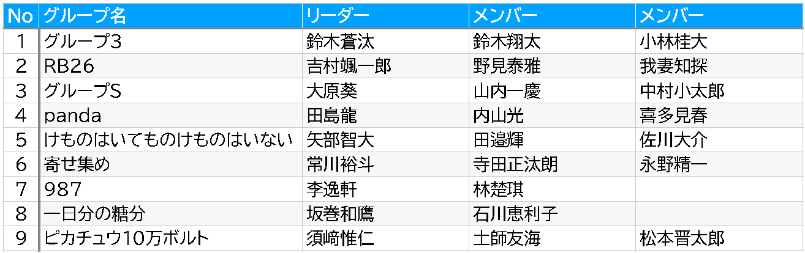

# コンピュータリテラシ発展 〜Pythonを学ぶ〜

## 第14回：グループワーク

情報学部 情報学科 情報メディア専攻
清水 哲也 ( shimizu@info.shonan-it.ac.jp )

---

# 今回の授業内容

---

# 今回の授業内容

- [グループワークの確認](#グループワークの確認)
- [スケジュール](#スケジュール)
- [今日の作業](#今日の作業)

---

# グループワークの確認

---

# グループワークの確認

<!-- グループワーク表を作成して貼り付ける -->

グループに所属していない学生は解説が終わった後に私のところに来てください．

---

# スケジュール

---

# スケジュール

## 第14回：グループごとにプログラムを作成

## 第15回：発表会

## 第16回：補講日

---

# スケジュール

## 第14回：グループごとにプログラムを作成

- 1月6日(月)
- グループごとにプログラムを作成します
- リーダーは適宜グループメンバーのサポートをしてください
- 第15回は発表をしますので発表の準備もしてください

---

# スケジュール

## 第15回：発表会

- 1月20日(月)
- 授業アンケートも実施します
- グループごとに作成したプログラムを発表します
- 発表方法は以下の通りです
  - dataに対して**何をどう解決するか** を説明します（スライド）
  - 各プログラムの動作を説明します（スライド）
  - 実演します（Colab）

---

# スケジュール

## 第16回：補講日

- 1月27日(月)
- 補講対象学生は[Moodle](https://moodle2024.shonan-it.ac.jp/course/view.php?id=1341)に学籍番号を提示します
- 補講対象学生は最終評価が少し足らない学生が対象です
- 基準は全体の評価が出てから決まります
- 補講対象学生以外は自宅学習となり出席扱いになります
- 補講対象学生は補講に不参加の場合不合格となる可能性があります

---

# 今日の作業

---

# グループワークの課題を再度確認

- Moodleにある[data.zip](https://moodle2024.shonan-it.ac.jp/mod/resource/view.php?id=46052)を使います
- グループでdataファイルの中身を確認してください
- この授業で習ったこととdataファイルの中身を使って何をするかをグループごとにきめてください
- 必ず1人1プログラムを作成してください

---

# dataフォルダについて

- dataフォルダには月ごとの売上データ（Excelファイル）と商品の単価表，商品名と商品コードの対応表があります
- 色々と問題があります
- 例
  - ファイル名が統一されていない
  - 日付表示になっていない
- グループごとに**何をどう解決するのか**を決めてください

---

# 今日の作業

- グループごとにプログラムを作成します
- リーダーは適宜グループメンバーのサポートをしてください
- 第15回は発表をしますので発表の準備もしてください
- 発表方法は以下の通りです
  - dataに対して**何をどう解決するか** を説明します（スライド）
  - 各プログラムの動作を説明します（スライド）
  - 実演します（Colab）
- 11:40までは教室で作業をしてください
- それ以降はリーダーの指示に従ってください